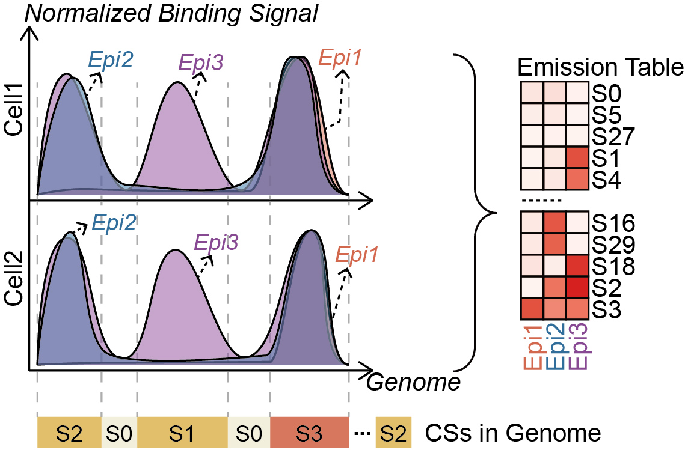
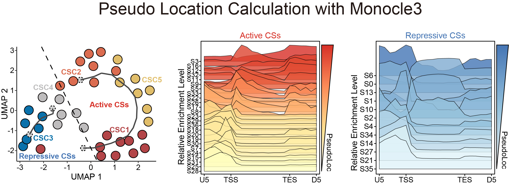
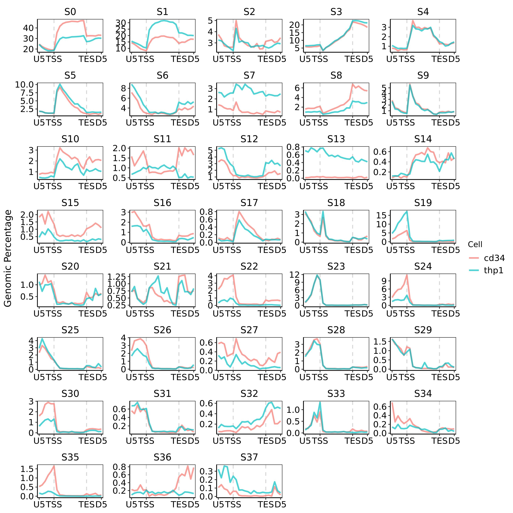

<p align="center">
  
</p>

**Chromatin Informative Dynamic Epigenomic Annotation Suite**（简称**chromIDEAS**）是一款针对染色质状态分析的多功能软件包，支持**一键计算染色质状态、绘制染色质状态在基因组上信号分布以及根据功能对染色质状态进行无监督聚类分析**。

语言：[[English]](https://github.com/fatyang799/chromIDEAS) [[中文]](https://github.com/fatyang799/chromIDEAS/blob/main/README_zh.md)

# ♕ 生物学背景简介

真核生物基因组通过染色质进行包装，其功能状态受到表观遗传修饰的动态调控。这些修饰在基因表达调控中发挥着核心作用，其**生物学功能往往与基因组分布特征密切相关**。这种空间特异性并非偶然现象，而是源于**转录因子和表观遗传酶被募集到特定基因组位点执行环境依赖性功能的结果**。例如，在转录起始位点（TSS）的**转录激活**需要RNA聚合酶II（Pol II）的募集，**在TSS处募集的Pol II，其CTD上的Ser5会被磷酸化激活，从而招募Set1修饰酶（H3K4me3的Writer酶）**，并伴随H3K4me3和H3K27ac等组蛋白修饰标记的形成；在基因体的**转录延伸过程，随着Pol II的CTD上Ser2的磷酸化激活，通过招募Set2修饰酶（H3K36me3的Writer酶）**，则以H3K36me3的沉积为特征。这些独特的分布模式反映了基因调控的特异性机制，也凸显了<strong style="color:red;">表观信号分布模式在解读表观转录调控中的关键作用</strong>。

鉴于表观遗传调控在癌症中的重要性，**传统癌症研究通常从鉴定差异表达基因入手，进而将这些变化与某些表观遗传信号相关联（例如H3K27me3或者H3K4me3）**。然而<strong style="color:red;">表观遗传调控本质上是一个高度复杂且相互关联的网络系统</strong>，孤立分析单个标记难以站在表观遗传学的<strong style="color:red;">整体角度</strong>来阐明疾病驱动机制。这一局限性在白血病等恶性肿瘤中尤为明显，其发病机制通常涉及全表观基因组的多种修饰信号失调而非单一修饰异常。而<strong style="color:red;">染色质状态（Chromatin States，CSs）被定义为多种不同表观遗传信号的复现性组合模式</strong>。如下图所示：

<p align="center">
  
</p>


> 一共绘制了2种细胞中3种不同表观信号的分布模式。其中有些区域总是只出现没有任何信号出现，这些区域的染色质状态定义为S0；有些区域则总是仅有Epi3信号，我们将其定义为S1；此外还有很多区域同时有3种信号同时出现，我们将其定义为S2。
>
> 根据这3种信号在基因组上共同出现的模式，我们使用chormIDEAS工具识别出所有可能共同出现的模式。在Emission table中进行归纳：热图中的红色深浅代表了每种信号在每种染色质状态中出现的概率高低。颜色越红则表示在该染色质状态中出现的概率越高。

染色质状态为应对上述挑战提供了更全面的研究视角。并且，由于**染色质状态的识别是基于隐马尔可夫模型（HMMs）**，这会比通过将不同单一表观信号的差异区域进行重叠计算**更具鲁棒性**，能更准确地识别可能导致致癌基因失调的调控区域，具有更低的假阳性率。此外，大规模参考表观基因组的高分辨率染色质状态图谱已日趋完善（包括Roadmap、ENCODE、UCSC等），这为染色质状态的深入研究奠定了坚实基础。

尽管具有重要价值，**现有染色质状态分析仍存在三大局限，阻碍其生物学解读**：（1）尽管已有充分证据表明表观信号分布模式在解读表观转录调控功能上的关键作用，**染色质状态功能注释主要依赖表观遗传信号组成，却普遍忽视基因组分布模式**；（2）当以高分辨率进行染色质状态识别时，现有方法**难以在过度细分的状态分类中区分功能相似但存在关键生物学差异的染色质状态变体**（例如，假设存在8种表观信号，其中有2种染色质状态的7种表观信号组成几乎一致，但是关键的H3K27me3信号的分布却存在显著差异，生物学上这2种染色质状态理论上功能会存在重大差异），导致影响解读；（3）分析方法通常需要多个高质量数据集作为**生物学重复**，这在染色质状态分析上具有挑战性。

在单细胞基因组学的分析中，通过将转录表达模式的细胞归类为功能相似的群体，细胞聚类分析既能增强细胞群之间的差异分辨率，又可降低细胞群内的噪声波动。受到该分析的启发，又基于<strong style="color:red;">染色质功能与其表观组成及基因组分布模式密切相关的特性</strong>，我们将单细胞算法中的聚类思想拓展到染色质状态分析，提出假设：<strong style="color:red;">同时具有相似表观信号组成 + 相似基因组分布模式的染色质状态功能相似</strong>。据此原理，我们开发了chromIDEAS，该计算框架通过整合（1）染色质状态的表观信号组成（来自Emission Table），决定各种染色质状态的定义；（2）染色质状态在基因组上分布模式，反映染色质状态的功能，对所有染色质状态进行无监督功能聚类。

<p align="center">
  
</p>


## 🔗 软件设计基础

chromIDEAS的实施奠基于一些已有工具，包括：

- IDEAS（DOI: 10.1093/nar/gkw278）：根据表观修饰的**数值型信号**，联合多细胞信息，进行统一染色质状态的识别（https://github.com/yuzhang123/IDEAS）
- S3V2（DOI: 10.1093/bioinformatics/btab148）：同时根据不同细胞间表观信号在背景区域和Peak区域的分布模式，对数据进行**标准化**（https://github.com/guanjue/S3V2_IDEAS_ESMP）
- Seurat（DOI: 10.1016/j.cell.2021.04.048）：使用**加权最近邻算法（Weighted Nearest Neighbor，WNN）**以合适的权重整合染色质状态在（1）表观信号组成（2）染色质状态在基因组上分布模式 这2个数据维度上的信息（https://github.com/satijalab/seurat）


## 🛠️ 软件功能

chromIDEAS支持的功能如下：

-  ✅   **（1）染色质状态识别：** 根据细胞中不同表观修饰的数值型信号，联合多种细胞信息，进行统一染色质状态的识别。
-  ✅   **（2）染色质状态分布模式绘制：** 绘制在给定区域或者给定基因集范围内所有染色质状态的分布信号。
-  ✅   **（3）染色质状态功能性聚类：** 根据染色质状态在基因组分布模式以及染色质的表观信号组成，通过WNN算法对所有染色质状态进行功能聚类。
-  ✅   **（4）染色质状态群功能鉴定：** 根据染色质状态的分群结果，对得到的染色质状态群进行表观信号特征的鉴定。
-  ✅   **（5）差异染色质状态基因鉴定：** 以染色质状态群为基本比较单元，对不同细胞进行差异鉴定，识别具有差异染色质状态群区域的基因。
-  ✅   **（6）差异染色质区域分布：** 对识别到的差异染色质状态基因进行分布区域鉴定，分析差异区域出现的概率分布。

<p align="center">
  <a href="https://chromideas.readthedocs.io" target="_blank">
  
</p>


拓展功能：

✅   **染色质状态空间衔接模式：** 根据染色质状态在基因组上的分布模式，计算从TSS到TES范围内，所有染色质状态的衔接顺序。

<p align="center">
  <a href="https://chromideas.readthedocs.io" target="_blank">
  
</p>


> 具体算法原理及使用方法请阅读chromIDEAS教程：<https://chromideas.readthedocs.io>


## 🌟 软件特征

-  ✅   **多线程：** 可以通过多线程运算，加速染色质状态的计算。相比原始S3V2软件包计算速度提升超过**5倍**
-  ✅   **多物种：** 支持任何物种的染色质状态计算
-  ✅   **多兼容：** 兼容任何染色质状态工具，在已有染色质状态结果的基础上进行功能聚类以及染色质状态分布绘制
-  ✅   **断点续运行：** 在原有S3V2及IDEAS的基础上，优化运行框架，支持断点续运行，加速计算
-  ✅   **一键安装：** 软件已经上线 conda 平台，一键安装


# 🏷 Logo含义

<p>
  
</p>


- **圆圈中的主图案**是用DNA双螺旋代表简化版的核小体模型，表示染色质状态的基本结构。
- **上方连接的四个圆点**：模拟分子聚合结构，同时也寓意“聚类关系”和“状态网络”。


# 🚀 快速开始

## 1. 软件安装

chromIDEAS软件已经上架 conda 平台，可以通过 conda 进行一键安装：

```bash
conda install fatyang::chromideas
```


## 2. 测试数据

我们提供来自人脐带血中的HSPC细胞（CD34+）及人白血病细胞系（THP1）的多种表观信号数据。为了方便计算，我们只使用**chr1**上的数据。

测试数据可以通过以下链接进行下载：

```bash
$ wget -U "Mozilla/5.0 (X11; Linux x86_64; rv:109.0) Gecko/20100101 Firefox/115.0" -c "https://figshare.com/ndownloader/files/56572916" -O chr1_cd34_thp1.tar.gz
$ tar xzf chr1_cd34_thp1.tar.gz
```


## 3. 运行

### 3.1 准备文件

#### 3.1.1 metadata.txt

在运行染色质状态识别时，我们需要提供metadata文件来告诉程序，不同细胞不同表观信号所对应的文件。

我们新建一个文件，命名为 `metadata.txt`，然后在里面加入下面的内容：

```bash
cd34	H3K27ac	rep3	./1.raw_bw/cd34_H3K27ac_rep3_SE.bw	./1.raw_bw/cd34_input_rep18_SE.bw
cd34	H3K27ac	rep4	./1.raw_bw/cd34_H3K27ac_rep4_SE.bw	./1.raw_bw/cd34_input_rep5_SE.bw
cd34	H3K27ac	rep5	./1.raw_bw/cd34_H3K27ac_rep5_SE.bw	./1.raw_bw/cd34_input_rep15_SE.bw
cd34	H3K27me3	rep11	./1.raw_bw/cd34_H3K27me3_rep11_SE.bw	./1.raw_bw/cd34_input_rep18_SE.bw
cd34	H3K27me3	rep1	./1.raw_bw/cd34_H3K27me3_rep1_SE.bw	./1.raw_bw/cd34_input_rep2_SE.bw
cd34	H3K27me3	rep2	./1.raw_bw/cd34_H3K27me3_rep2_SE.bw	./1.raw_bw/cd34_input_rep8_SE.bw
cd34	H3K27me3	rep3	./1.raw_bw/cd34_H3K27me3_rep3_SE.bw	./1.raw_bw/cd34_input_rep1_SE.bw
cd34	H3K27me3	rep4	./1.raw_bw/cd34_H3K27me3_rep4_SE.bw	./1.raw_bw/cd34_input_rep12_SE.bw
cd34	H3K27me3	rep5	./1.raw_bw/cd34_H3K27me3_rep5_SE.bw	./1.raw_bw/cd34_input_rep5_SE.bw
cd34	H3K27me3	rep6	./1.raw_bw/cd34_H3K27me3_rep6_SE.bw	./1.raw_bw/cd34_input_rep6_SE.bw
cd34	H3K27me3	rep7	./1.raw_bw/cd34_H3K27me3_rep7_SE.bw	./1.raw_bw/cd34_input_rep4_SE.bw
cd34	H3K27me3	rep8	./1.raw_bw/cd34_H3K27me3_rep8_SE.bw	./1.raw_bw/cd34_input_rep10_SE.bw
cd34	H3K27me3	rep9	./1.raw_bw/cd34_H3K27me3_rep9_SE.bw	./1.raw_bw/cd34_input_rep11_SE.bw
cd34	H3K36me3	rep10	./1.raw_bw/cd34_H3K36me3_rep10_SE.bw	./1.raw_bw/cd34_input_rep18_SE.bw
cd34	H3K36me3	rep1	./1.raw_bw/cd34_H3K36me3_rep1_SE.bw	./1.raw_bw/cd34_input_rep1_SE.bw
cd34	H3K36me3	rep2	./1.raw_bw/cd34_H3K36me3_rep2_SE.bw	./1.raw_bw/cd34_input_rep4_SE.bw
cd34	H3K36me3	rep3	./1.raw_bw/cd34_H3K36me3_rep3_SE.bw	./1.raw_bw/cd34_input_rep12_SE.bw
cd34	H3K36me3	rep4	./1.raw_bw/cd34_H3K36me3_rep4_SE.bw	./1.raw_bw/cd34_input_rep5_SE.bw
cd34	H3K36me3	rep6	./1.raw_bw/cd34_H3K36me3_rep6_SE.bw	./1.raw_bw/cd34_input_rep2_SE.bw
cd34	H3K36me3	rep7	./1.raw_bw/cd34_H3K36me3_rep7_SE.bw	./1.raw_bw/cd34_input_rep3_SE.bw
cd34	H3K36me3	rep8	./1.raw_bw/cd34_H3K36me3_rep8_SE.bw	./1.raw_bw/cd34_input_rep10_SE.bw
cd34	H3K36me3	rep9	./1.raw_bw/cd34_H3K36me3_rep9_SE.bw	./1.raw_bw/cd34_input_rep11_SE.bw
cd34	H3K4me1	rep1	./1.raw_bw/cd34_H3K4me1_rep1_SE.bw	./1.raw_bw/cd34_input_rep2_SE.bw
cd34	H3K4me1	rep2	./1.raw_bw/cd34_H3K4me1_rep2_SE.bw	./1.raw_bw/cd34_input_rep3_SE.bw
cd34	H3K4me1	rep3	./1.raw_bw/cd34_H3K4me1_rep3_SE.bw	./1.raw_bw/cd34_input_rep4_SE.bw
cd34	H3K4me1	rep4	./1.raw_bw/cd34_H3K4me1_rep4_SE.bw	./1.raw_bw/cd34_input_rep10_SE.bw
cd34	H3K4me1	rep5	./1.raw_bw/cd34_H3K4me1_rep5_SE.bw	./1.raw_bw/cd34_input_rep5_SE.bw
cd34	H3K4me1	rep6	./1.raw_bw/cd34_H3K4me1_rep6_SE.bw	./1.raw_bw/cd34_input_rep8_SE.bw
cd34	H3K4me1	rep7	./1.raw_bw/cd34_H3K4me1_rep7_SE.bw	./1.raw_bw/cd34_input_rep1_SE.bw
cd34	H3K4me1	rep8	./1.raw_bw/cd34_H3K4me1_rep8_SE.bw	./1.raw_bw/cd34_input_rep11_SE.bw
cd34	H3K4me1	rep9	./1.raw_bw/cd34_H3K4me1_rep9_SE.bw	./1.raw_bw/cd34_input_rep15_SE.bw
cd34	H3K4me3	rep10	./1.raw_bw/cd34_H3K4me3_rep10_SE.bw	./1.raw_bw/cd34_input_rep11_SE.bw
cd34	H3K4me3	rep1	./1.raw_bw/cd34_H3K4me3_rep1_SE.bw	./1.raw_bw/cd34_input_rep2_SE.bw
cd34	H3K4me3	rep2	./1.raw_bw/cd34_H3K4me3_rep2_SE.bw	./1.raw_bw/cd34_input_rep3_SE.bw
cd34	H3K4me3	rep3	./1.raw_bw/cd34_H3K4me3_rep3_SE.bw	./1.raw_bw/cd34_input_rep8_SE.bw
cd34	H3K4me3	rep4	./1.raw_bw/cd34_H3K4me3_rep4_SE.bw	./1.raw_bw/cd34_input_rep9_SE.bw
cd34	H3K4me3	rep5	./1.raw_bw/cd34_H3K4me3_rep5_SE.bw	./1.raw_bw/cd34_input_rep1_SE.bw
cd34	H3K4me3	rep6	./1.raw_bw/cd34_H3K4me3_rep6_SE.bw	./1.raw_bw/cd34_input_rep4_SE.bw
cd34	H3K4me3	rep7	./1.raw_bw/cd34_H3K4me3_rep7_SE.bw	./1.raw_bw/cd34_input_rep12_SE.bw
cd34	H3K4me3	rep8	./1.raw_bw/cd34_H3K4me3_rep8_SE.bw	./1.raw_bw/cd34_input_rep6_SE.bw
cd34	H3K4me3	rep9	./1.raw_bw/cd34_H3K4me3_rep9_SE.bw	./1.raw_bw/cd34_input_rep10_SE.bw
cd34	H3K9me3	rep1	./1.raw_bw/cd34_H3K9me3_rep1_SE.bw	./1.raw_bw/cd34_input_rep4_SE.bw
cd34	H3K9me3	rep2	./1.raw_bw/cd34_H3K9me3_rep2_SE.bw	./1.raw_bw/cd34_input_rep1_SE.bw
cd34	H3K9me3	rep3	./1.raw_bw/cd34_H3K9me3_rep3_SE.bw	./1.raw_bw/cd34_input_rep12_SE.bw
cd34	H3K9me3	rep4	./1.raw_bw/cd34_H3K9me3_rep4_SE.bw	./1.raw_bw/cd34_input_rep6_SE.bw
cd34	H3K9me3	rep5	./1.raw_bw/cd34_H3K9me3_rep5_SE.bw	./1.raw_bw/cd34_input_rep5_SE.bw
cd34	H3K9me3	rep6	./1.raw_bw/cd34_H3K9me3_rep6_SE.bw	./1.raw_bw/cd34_input_rep8_SE.bw
cd34	H3K9me3	rep7	./1.raw_bw/cd34_H3K9me3_rep7_SE.bw	./1.raw_bw/cd34_input_rep2_SE.bw
cd34	H3K9me3	rep8	./1.raw_bw/cd34_H3K9me3_rep8_SE.bw	./1.raw_bw/cd34_input_rep3_SE.bw
cd34	H3K9me3	rep9	./1.raw_bw/cd34_H3K9me3_rep9_SE.bw	./1.raw_bw/cd34_input_rep10_SE.bw
cd34	H3K27me3	rep12	./1.raw_bw/cd34_H3K27me3_rep12_PE.bw	./1.raw_bw/cd34_input_rep19_PE.bw
cd34	H3K27me3	rep13	./1.raw_bw/cd34_H3K27me3_rep13_PE.bw	./1.raw_bw/cd34_input_rep20_PE.bw
cd34	H3K27me3	rep14	./1.raw_bw/cd34_H3K27me3_rep14_PE.bw	./1.raw_bw/cd34_input_rep21_PE.bw
cd34	H3K27me3	rep15	./1.raw_bw/cd34_H3K27me3_rep15_SE.bw
cd34	H3K4me3	rep11	./1.raw_bw/cd34_H3K4me3_rep11_PE.bw	./1.raw_bw/cd34_input_rep19_PE.bw
cd34	H3K4me3	rep12	./1.raw_bw/cd34_H3K4me3_rep12_PE.bw	./1.raw_bw/cd34_input_rep20_PE.bw
cd34	H3K4me3	rep13	./1.raw_bw/cd34_H3K4me3_rep13_SE.bw
cd34	H3K79me2	rep2	./1.raw_bw/cd34_H3K79me2_rep2_PE.bw	./1.raw_bw/cd34_input_rep19_PE.bw
cd34	H3K79me2	rep3	./1.raw_bw/cd34_H3K79me2_rep3_PE.bw	./1.raw_bw/cd34_input_rep20_PE.bw
cd34	H3K79me2	rep4	./1.raw_bw/cd34_H3K79me2_rep4_PE.bw	./1.raw_bw/cd34_input_rep21_PE.bw
thp1	H3K36me3	rep1	./1.raw_bw/thp1_H3K36me3_rep1_PE.bw	./1.raw_bw/thp1_mock_rep1_PE.bw
thp1	H3K36me3	rep2	./1.raw_bw/thp1_H3K36me3_rep2_PE.bw	./1.raw_bw/thp1_mock_rep1_PE.bw
thp1	H3K36me3	rep3	./1.raw_bw/thp1_H3K36me3_rep3_PE.bw	./1.raw_bw/thp1_mock_rep2_PE.bw
thp1	H3K36me3	rep4	./1.raw_bw/thp1_H3K36me3_rep4_PE.bw	./1.raw_bw/thp1_mock_rep2_PE.bw
thp1	H3K79me2	rep1	./1.raw_bw/thp1_H3K79me2_rep1_PE.bw	./1.raw_bw/thp1_input_rep3_PE.bw
thp1	H3K27me3	rep3	./1.raw_bw/thp1_H3K27me3_rep3_PE.bw	./1.raw_bw/thp1_input_rep4_PE.bw
thp1	H3K27me3	rep4	./1.raw_bw/thp1_H3K27me3_rep4_PE.bw	./1.raw_bw/thp1_input_rep4_PE.bw
thp1	H3K27ac	rep2	./1.raw_bw/thp1_H3K27ac_rep2_PE.bw	./1.raw_bw/thp1_input_rep4_PE.bw
thp1	H3K27ac	rep3	./1.raw_bw/thp1_H3K27ac_rep3_PE.bw	./1.raw_bw/thp1_input_rep4_PE.bw
thp1	H3K4me1	rep2	./1.raw_bw/thp1_H3K4me1_rep2_PE.bw	./1.raw_bw/thp1_input_rep4_PE.bw
thp1	H3K4me1	rep3	./1.raw_bw/thp1_H3K4me1_rep3_PE.bw	./1.raw_bw/thp1_input_rep4_PE.bw
thp1	H3K4me3	rep2	./1.raw_bw/thp1_H3K4me3_rep2_PE.bw	./1.raw_bw/thp1_input_rep4_PE.bw
thp1	H3K4me3	rep3	./1.raw_bw/thp1_H3K4me3_rep3_PE.bw	./1.raw_bw/thp1_input_rep4_PE.bw
thp1	H3K9me3	rep3	./1.raw_bw/thp1_H3K9me3_rep3_PE.bw	./1.raw_bw/thp1_input_rep4_PE.bw
thp1	H3K9me3	rep4	./1.raw_bw/thp1_H3K9me3_rep4_PE.bw	./1.raw_bw/thp1_input_rep4_PE.bw
cd34	ATAC	rep1	./1.raw_bw/cd34_ATAC_rep1_PE.bw
cd34	ATAC	rep2	./1.raw_bw/cd34_ATAC_rep2_PE.bw
thp1	ATAC	rep3	./1.raw_bw/thp1_ATAC_rep3_PE.bw
thp1	ATAC	rep4	./1.raw_bw/thp1_ATAC_rep4_PE.bw
```

其中每一行代表细胞的一个表观修饰信号数据集，以 "tab" 分割，格式说明如下：

- col1：细胞类型
- col2：表观修饰类型
- col3：生物学重复
- col4：实验组数据集地址
- col5：（可选）对应的control数据集地址

#### 3.1.2 基因组长度文件

因为这里我们只使用了chr1的数据，所以我们需要指定具体的基因组长度。

我们可以新建一个文件，将其命名为 `chr1.txt`，并在其中填充如下内容：

```tex
chr1	248956422
```

其中每一行代表一条染色质的长度，以 "tab" 分割，格式说明如下：

- col1：染色体号
- col2：染色体长度

#### 3.1.3 blacklist文件（可选）

我们可以通过指定blacklist文件，排除一些可能存在问题的区域。具体文件可以通过下面指定进行下载：

```shell
$ wget https://github.com/Boyle-Lab/Blacklist/raw/master/lists/hg38-blacklist.v2.bed.gz
$ gunzip https://github.com/Boyle-Lab/Blacklist/raw/master/lists/hg38-blacklist.v2.bed.gz
```

#### 3.1.4 文件总结

在开始运行前，我们组织下准备好的相关文件：

```shell
$ mkdir -p 0.sup_dat 1.raw_bw
$ mv metadata.txt chr1.txt hg38-blacklist.v2.bed 0.sup_dat
$ mv *.bw 1.raw_bw
$ tree
.
├── 0.sup_dat
│   ├── chr1.txt
│   ├── hg38-blacklist.v2.bed
│   └── metadata.txt
├── 1.raw_bw
│   ├── cd34_ATAC_rep1_PE.bw
│   ├── cd34_ATAC_rep2_PE.bw
│   ├── cd34_H3K27ac_rep3_SE.bw
│   ├── cd34_H3K27ac_rep4_SE.bw
......
│   ├── thp1_input_rep4_PE.bw
│   ├── thp1_mock_rep1_PE.bw
│   └── thp1_mock_rep2_PE.bw
└── chr1_cd34_thp1.tar.gz
```

### 3.2 染色质状态的识别

#### 3.2.1 一键识别

然后我们可以使用下面的命令，一键得到染色质状态的结果：

```shell
$ time chromIDEAS -m 0.sup_dat/metadata.txt -o 2.CS_Segmentation/ -b 200 -g 0.sup_dat/chr1.txt -n hg38_chr1 -B 0.sup_dat/hg38-blacklist.v2.bed -c -d chr1 -p 20
Now process (1) genomeWindows.
Process (1) genomeWindows done successfully.
------------------------------------------------------------------------

Now process (2) bigWig2bedGraph.
The /share/home/fatyang/2.CS_Segmentation/1.bigWig2bedGraph directory is not exist. The program will create it.
################# Multiple mode #################
./1.raw_bw/cd34_H3K27me3_rep2_SE.bw has been converted to bedgraph format succussfully.
./1.raw_bw/cd34_H3K27me3_rep13_PE.bw has been converted to bedgraph format succussfully.
./1.raw_bw/cd34_H3K27ac_rep5_SE.bw has been converted to bedgraph format succussfully.
...
All bigWig files have been convert to bedGraph.
Process (2) bigWig2bedGraph done successfully.
------------------------------------------------------------------------

The /share/home/fatyang/2.CS_Segmentation/2.s3v2Norm directory is not exist. The program will create it.
Now process (3) s3v2norm.
########################## s3v2Norm Start ##########################
[1] "/share/home/fatyang/2.CS_Segmentation/1.bigWig2bedGraph/cd34.H3K9me3.rep1.ip.idsort.bedgraph.gz"
[1] "/share/home/fatyang/2.CS_Segmentation/1.bigWig2bedGraph/cd34.H3K27ac.rep3.ip.idsort.bedgraph.gz"
[1] "/share/home/fatyang/2.CS_Segmentation/1.bigWig2bedGraph/cd34.H3K79me2.rep2.ip.idsort.bedgraph.gz"
...
1.Get cpk cbg allpk average_sig done
2.S3norm average across marks done
        3.S3V2 across samples   ATAC done
        3.S3V2 across samples   H3K27ac done
        3.S3V2 across samples   H3K27me3 done
        3.S3V2 across samples   H3K36me3 done
        3.S3V2 across samples   H3K4me1 done
        3.S3V2 across samples   H3K4me3 done
        3.S3V2 across samples   H3K79me2 done
        3.S3V2 across samples   H3K9me3 done
3.S3V2 across samples with same mk done
4.S3V2 across CT samples done
5.Get NBP for S3V2 normalized data done
All bedGraph files have been convert to bigWig.
6.Convert the bedgraph file into bigWig format.
########################## s3v2Norm End ##########################

Summary for normalization:
Ready to show Summary: 3s
Ready to show Summary: 2s
Ready to show Summary: 1s
#=============================================Summary for normalization=============================================#
############# 1: get cpk cbg allpk average_sig #############
Nothing requiring additional attention


############# 2: S3norm average across marks #############
The normalization parameters (norm=A*raw^B):
        1) ATAC:
                Mean_ratio           S3norm_B            S3norm_A
                0.31912402579647464  0.6911416007650284  0.5208180030840445
        2) H3K27ac:
                Mean_ratio          S3norm_B            S3norm_A
                0.2642206363218819  0.6683547414300661  0.5435931404498152
        3) H3K27me3:
                Mean_ratio          S3norm_B            S3norm_A
                0.4239141842940278  1.0985441458588523  0.4174344884621977
        4) H3K36me3:
                Mean_ratio          S3norm_B            S3norm_A
                0.5963609714221206  1.0686476970950924  0.6252879289145848
        5) H3K4me1:
                Mean_ratio          S3norm_B            S3norm_A
                0.4325845586543525  0.9183362183254749  0.5464312537007742
        6) H3K4me3:
                Mean_ratio           S3norm_B           S3norm_A
                0.42192289933009874  0.665722690663896  0.720874862499352
        7) H3K79me2:
                Mean_ratio           S3norm_B           S3norm_A
                0.20716204795844023  0.854490378839077  0.2992704109344474
        8) H3K9me3:
                Mean_ratio           S3norm_B            S3norm_A
                0.49297130091515795  1.0498449905490717  0.4729004821135292


############# 3: S3V2 across samples with same mk #############
The normalization parameters:
norm_dat = norm_pk + norm_bg
        1) cd34_rep10.H3K36me3.S3V2.bedgraph:
                Pk region normalization parameters [exponential regression: norm=(2^A)*(raw^B)]:
                        pk_b               pk_a
                        0.860268522487943  0
                Bg region normalization parameters [linear regression: norm=B*raw+A]:
                        bg_b               bg_a
                        0.379774849916617  -0.054080182987012
        2) cd34_rep10.H3K4me3.S3V2.bedgraph:
                Pk region normalization parameters [exponential regression: norm=(2^A)*(raw^B)]:
                        pk_b               pk_a
                        0.831459440130634  0
                Bg region normalization parameters [linear regression: norm=B*raw+A]:
                        bg_b               bg_a
                        0.831817269539945  -0.0950225927820069
        3) cd34_rep11.H3K27me3.S3V2.bedgraph:
                Pk region normalization parameters [exponential regression: norm=(2^A)*(raw^B)]:
                        pk_b               pk_a
                        0.937802347054138  0
                Bg region normalization parameters [linear regression: norm=B*raw+A]:
                        bg_b               bg_a
                        0.788937931828074  -0.56781334660776
...


############# 4: S3V2 across CT samples #############
The normalization parameters [linear regression: norm=B*raw+A]:
        1) cd34.ATAC.rep1.ctrl.idsort.bedgraph.gz.norm.bedgraph:
                B  A
                1  0
        2) cd34.ATAC.rep2.ctrl.idsort.bedgraph.gz.norm.bedgraph:
                B  A
                1  0
        3) cd34.H3K27ac.rep3.ctrl.idsort.bedgraph.gz.norm.bedgraph:
                B                 A
                2.08476397079908  -8.09980879317122
...


############# 5: Get NBP for S3V2 normalized data #############
Fit the s3v2 norm data to NB model:
        1) The normalization parameters for average signal of ATAC:
                AVEmat_cbg_prob    AVEmat_cbg_size   scale_down
                0.903295995216867  8.72511681090712  1
        2) The normalization parameters for average signal of H3K27ac:
                AVEmat_cbg_prob    AVEmat_cbg_size   scale_down
                0.839476840723447  9.03072014304272  1
        3) The normalization parameters for average signal of H3K27me3:
                AVEmat_cbg_prob    AVEmat_cbg_size   scale_down
                0.902594813746805  17.7791989962796  1
        4) The normalization parameters for average signal of H3K36me3:
                AVEmat_cbg_prob    AVEmat_cbg_size   scale_down
                0.760129737927078  7.60914042205539  1
        5) The normalization parameters for average signal of H3K4me1:
                AVEmat_cbg_prob    AVEmat_cbg_size   scale_down
                0.571775852101361  3.82876573811324  1
        6) The normalization parameters for average signal of H3K4me3:
                AVEmat_cbg_prob   AVEmat_cbg_size   scale_down
                0.57108169816322  2.68410297948551  1
        7) The normalization parameters for average signal of H3K79me2:
                AVEmat_cbg_prob    AVEmat_cbg_size   scale_down
                0.733551180969329  3.71929718967958  1
        8) The normalization parameters for average signal of H3K9me3:
                AVEmat_cbg_prob    AVEmat_cbg_size   scale_down
                0.937901568499601  22.8114694786224  1


Process (3) s3v2Norm done successfully.
------------------------------------------------------------------------

Now process (4) mergeBedgraph.
################# Multiple mode #################
/share/home/fatyang/2.CS_Segmentation/2.s3v2Norm/chr1_bws_NBP/cd34_rep1.ATAC.S3V2.bedgraph.NBP.bedgraph.bw has been converted to bedgraph format succussfully.
/share/home/fatyang/2.CS_Segmentation/2.s3v2Norm/chr1_bws_NBP/cd34_rep10.H3K4me3.S3V2.bedgraph.NBP.bedgraph.bw has been converted to bedgraph format succussfully.
/share/home/fatyang/2.CS_Segmentation/2.s3v2Norm/chr1_bws_NBP/cd34_rep13.H3K4me3.S3V2.bedgraph.NBP.bedgraph.bw has been converted to bedgraph format succussfully.
...
All bigWig files have been convert to bedGraph.
Process (4) mergeBedgraph done successfully.
------------------------------------------------------------------------

Now process (5) ideasCS.

real    45m48.857s
user    711m49.403s
sys     14m19.501s
Process (5) ideasCS done successfully.
------------------------------------------------------------------------


real    59m3.904s
user    841m18.733s
sys     28m10.912s
```

#### 3.2.2 分步识别

我们也可以分3步进行。

**（1）数据标准化：**

```shell
$ time s3v2Norm -b 200 -o 2.CS_Segmentation/ -m 0.sup_dat/metadata.txt -n hg38_chr1 -c -d chr1 -p 20 -g 0.sup_dat/chr1.txt -B 0.sup_dat/hg38-blacklist.v2.bed
Now process (1) genomeWindows.
Process (1) genomeWindows done successfully.
------------------------------------------------------------------------

Now process (2) bigWig2bedGraph.
The /share/home/fatyang/2.CS_Segmentation/1.bigWig2bedGraph directory is not exist. The program will create it.
################# Multiple mode #################
./1.raw_bw/cd34_H3K27ac_rep4_SE.bw has been converted to bedgraph format succussfully.
./1.raw_bw/cd34_H3K27me3_rep1_SE.bw has been converted to bedgraph format succussfully.
./1.raw_bw/cd34_H3K27ac_rep3_SE.bw has been converted to bedgraph format succussfully.
......
All bigWig files have been convert to bedGraph.
Process (2) bigWig2bedGraph done successfully.
------------------------------------------------------------------------

The /share/home/fatyang/2.CS_Segmentation/2.s3v2Norm directory is not exist. The program will create it.
Now process (3) s3v2norm.
########################## s3v2Norm Start ##########################
[1] "/share/home/fatyang/2.CS_Segmentation/1.bigWig2bedGraph/cd34.H3K4me3.rep10.ip.idsort.bedgraph.gz"
[1] "/share/home/fatyang/2.CS_Segmentation/1.bigWig2bedGraph/cd34.H3K27ac.rep3.ip.idsort.bedgraph.gz"
[1] "/share/home/fatyang/2.CS_Segmentation/1.bigWig2bedGraph/cd34.ATAC.rep1.ip.idsort.bedgraph.gz"
...
1.Get cpk cbg allpk average_sig done
2.S3norm average across marks done
        3.S3V2 across samples   ATAC done
        3.S3V2 across samples   H3K27ac done
        3.S3V2 across samples   H3K27me3 done
        3.S3V2 across samples   H3K36me3 done
        3.S3V2 across samples   H3K4me1 done
        3.S3V2 across samples   H3K4me3 done
        3.S3V2 across samples   H3K79me2 done
        3.S3V2 across samples   H3K9me3 done
3.S3V2 across samples with same mk done
4.S3V2 across CT samples done
5.Get NBP for S3V2 normalized data done
All bedGraph files have been convert to bigWig.
6.Convert the bedgraph file into bigWig format.
########################## s3v2Norm End ##########################

Summary for normalization:
Ready to show Summary: 3s
Ready to show Summary: 2s
Ready to show Summary: 1s
#=============================================Summary for normalization=============================================#
############# 1: get cpk cbg allpk average_sig #############
Nothing requiring additional attention


############# 2: S3norm average across marks #############
The normalization parameters (norm=A*raw^B):
        1) ATAC:
                Mean_ratio           S3norm_B            S3norm_A
                0.31912402579647464  0.6911416007650284  0.5208180030840445
        2) H3K27ac:
                Mean_ratio          S3norm_B            S3norm_A
                0.2642206363218819  0.6683547414300661  0.5435931404498152
        3) H3K27me3:
                Mean_ratio          S3norm_B            S3norm_A
                0.4239141842940278  1.0985441458588523  0.4174344884621977
        4) H3K36me3:
                Mean_ratio          S3norm_B            S3norm_A
                0.5963609714221206  1.0686476970950924  0.6252879289145848
        5) H3K4me1:
                Mean_ratio          S3norm_B            S3norm_A
                0.4325845586543525  0.9183362183254749  0.5464312537007742
        6) H3K4me3:
                Mean_ratio           S3norm_B           S3norm_A
                0.42192289933009874  0.665722690663896  0.720874862499352
        7) H3K79me2:
                Mean_ratio           S3norm_B           S3norm_A
                0.20716204795844023  0.854490378839077  0.2992704109344474
        8) H3K9me3:
                Mean_ratio           S3norm_B            S3norm_A
                0.49297130091515795  1.0498449905490717  0.4729004821135292


############# 3: S3V2 across samples with same mk #############
The normalization parameters:
norm_dat = norm_pk + norm_bg
        1) cd34_rep10.H3K36me3.S3V2.bedgraph:
                Pk region normalization parameters [exponential regression: norm=(2^A)*(raw^B)]:
                        pk_b               pk_a
                        0.860268522487943  0
                Bg region normalization parameters [linear regression: norm=B*raw+A]:
                        bg_b               bg_a
                        0.379774849916617  -0.054080182987012
        2) cd34_rep10.H3K4me3.S3V2.bedgraph:
                Pk region normalization parameters [exponential regression: norm=(2^A)*(raw^B)]:
                        pk_b               pk_a
                        0.831459440130634  0
                Bg region normalization parameters [linear regression: norm=B*raw+A]:
                        bg_b               bg_a
                        0.831817269539945  -0.0950225927820069
        3) cd34_rep11.H3K27me3.S3V2.bedgraph:
                Pk region normalization parameters [exponential regression: norm=(2^A)*(raw^B)]:
                        pk_b               pk_a
                        0.937802347054138  0
                Bg region normalization parameters [linear regression: norm=B*raw+A]:
                        bg_b               bg_a
                        0.788937931828074  -0.56781334660776
...


############# 4: S3V2 across CT samples #############
The normalization parameters [linear regression: norm=B*raw+A]:
        1) cd34.ATAC.rep1.ctrl.idsort.bedgraph.gz.norm.bedgraph:
                B  A
                1  0
        2) cd34.ATAC.rep2.ctrl.idsort.bedgraph.gz.norm.bedgraph:
                B  A
                1  0
        3) cd34.H3K27ac.rep3.ctrl.idsort.bedgraph.gz.norm.bedgraph:
                B                 A
                2.08476397079908  -8.09980879317122
...


############# 5: Get NBP for S3V2 normalized data #############
Fit the s3v2 norm data to NB model:
        1) The normalization parameters for average signal of ATAC:
                AVEmat_cbg_prob    AVEmat_cbg_size   scale_down
                0.903295995216867  8.72511681090712  1
        2) The normalization parameters for average signal of H3K27ac:
                AVEmat_cbg_prob    AVEmat_cbg_size   scale_down
                0.839476840723447  9.03072014304272  1
        3) The normalization parameters for average signal of H3K27me3:
                AVEmat_cbg_prob    AVEmat_cbg_size   scale_down
                0.902594813746805  17.7791989962796  1
        4) The normalization parameters for average signal of H3K36me3:
                AVEmat_cbg_prob    AVEmat_cbg_size   scale_down
                0.760129737927078  7.60914042205539  1
        5) The normalization parameters for average signal of H3K4me1:
                AVEmat_cbg_prob    AVEmat_cbg_size   scale_down
                0.571775852101361  3.82876573811324  1
        6) The normalization parameters for average signal of H3K4me3:
                AVEmat_cbg_prob   AVEmat_cbg_size   scale_down
                0.57108169816322  2.68410297948551  1
        7) The normalization parameters for average signal of H3K79me2:
                AVEmat_cbg_prob    AVEmat_cbg_size   scale_down
                0.733551180969329  3.71929718967958  1
        8) The normalization parameters for average signal of H3K9me3:
                AVEmat_cbg_prob    AVEmat_cbg_size   scale_down
                0.937901568499601  22.8114694786224  1


Process (3) s3v2norm done successfully.
------------------------------------------------------------------------


real    11m41.485s
user    111m7.597s
sys     10m7.581s
```

> 作为比较，我们采用相同的参数，相同的数据，使用S3V2（https://github.com/guanjue/S3V2_IDEAS_ESMP）处理。由于S3V2中对于线程设置上最高只能为4，我们将其设置为最高线程。我们同样统计了运行时间：
>
> ```shell
> real    52m54.052s
> user    129m33.996s
> sys     13m47.043s
> ```
>
> 可以看到，经过优化后的chromIDEAS在运行数据标准化时，消耗的时间为11m41.485s，而原始S3V2处理相同数据时则消耗更多的时间52m54.052s。

**（2）合并重复样本：**

```shell
$ mkdir -p 2.CS_Segmentation/3.CS_segmentation/chr1_IDEAS_input_NB
$ rm -rf 2.CS_Segmentation/3.CS_segmentation/chr1_IDEAS_input_NB/group.799[12]799.txt
$ ls 2.CS_Segmentation/2.s3v2Norm/chr1_bws_NBP/*S3V2.bedgraph.NBP.bedgraph.bw | while read id
do
    bedg=$(basename $id | sed -r "s/.bw$//g")
    echo -e "${id}\t2.CS_Segmentation/3.CS_segmentation/chr1_IDEAS_input_NB/${bedg}" >> 2.CS_Segmentation/3.CS_segmentation/chr1_IDEAS_input_NB/group.7991799.txt

    cell=$(basename $id | cut -d "_" -f1)
    mk=$(basename $id | cut -d "." -f2)
    echo -e "2.CS_Segmentation/3.CS_segmentation/chr1_IDEAS_input_NB/${bedg}\t2.CS_Segmentation/3.CS_segmentation/chr1_IDEAS_input_NB/${cell}.${mk}.S3V2.bedgraph.NBP.txt" >> 2.CS_Segmentation/3.CS_segmentation/chr1_IDEAS_input_NB/group.7992799.txt
done

$ bigWig2bedGraph -n hg38_chr1 -f 2.CS_Segmentation/3.CS_segmentation/chr1_IDEAS_input_NB/group.7991799.txt -p 20 -b 200
################# Multiple mode #################
2.CS_Segmentation/2.s3v2Norm/chr1_bws_NBP/cd34_rep1.H3K36me3.S3V2.bedgraph.NBP.bedgraph.bw has been converted to bedgraph format succussfully.
2.CS_Segmentation/2.s3v2Norm/chr1_bws_NBP/cd34_rep12.H3K4me3.S3V2.bedgraph.NBP.bedgraph.bw has been converted to bedgraph format succussfully.
2.CS_Segmentation/2.s3v2Norm/chr1_bws_NBP/cd34_rep1.H3K27me3.S3V2.bedgraph.NBP.bedgraph.bw has been converted to bedgraph format succussfully.
...
All bigWig files have been convert to bedGraph.

$ mergeBedgraph -f 2.CS_Segmentation/3.CS_segmentation/chr1_IDEAS_input_NB/group.7992799.txt -m median -c pearson -p 20
$ cut -f2 2.CS_Segmentation/3.CS_segmentation/chr1_IDEAS_input_NB/group.7991799.txt | xargs -n1 -i rm -rf {}
$ cat 0.sup_dat/metadata.txt | while read cell mk id exp ct
do
    echo "${cell} ${mk} 2.CS_Segmentation/3.CS_segmentation/chr1_IDEAS_input_NB/${cell}.${mk}.S3V2.bedgraph.NBP.txt"
done | sort -u > 2.CS_Segmentation/3.CS_segmentation/chr1_IDEAS_input_NB/meta.txt

$ rm -rf 2.CS_Segmentation/3.CS_segmentation/chr1_IDEAS_input_NB/group.799[12]799.txt
```

**（3）染色质状态识别：**

```shell
$ ideasCS -m s3v2/3.CS_segmentation/chr1_IDEAS_input_NB/meta.txt -o s3v2/4.chr1_IDEAS_output -d chr1 -p 20

real    44m22.538s
user    712m10.945s
sys     11m7.006s
```

> 作为比较，我们采用相同的参数，相同的数据，使用S3V2（https://github.com/guanjue/S3V2_IDEAS_ESMP）处理。由于S3V2中对于线程设置上最高只能为4，我们将其设置为最高线程。我们同样统计了运行时间：
>
> ```shell
> real    132m56.320s
> user    788m50.320s
> sys     15m58.419s
> ```
>
> 可以看到，经过优化后的chromIDEAS在识别染色质状态时，消耗的时间为44m22.538s，而原始S3V2处理相同数据时则消耗更多的时间132m56.320s。

### 3.2 染色质状态基因组分布模式的绘制

```shell
# wget https://ftp.ebi.ac.uk/pub/databases/gencode/Gencode_human/release_40/gencode.v40.annotation.gtf.gz
# gunzip gencode.v40.annotation.gtf.gz

$ awk -F "\t" '{if($1 == "chr1") {print $0}}' /share/home/fatyang/Genomes/GENCODE/Human/hg38/gtf/gencode.v40.annotation.gtf > chr1.gtf
$ plotCSprofile TSS -i 2.CS_Segmentation/4.chr1_IDEAS_output/chr1.state -o tss.jpg -r chr1.gtf -W 10 -H 10
############################## Prepare the CS matrix ##############################
U5 U4 U3 U2 U1 TSS D1 D2 D3 D4 D5
###################################### Done #######################################

############################## Calculate cell specific CS matrix ##############################
cd34:
thp1:
############################################ Done #############################################

############################## Plot cell specific CS distribution ##############################
############################################# Done #############################################

$ plotCSprofile Body -i 2.CS_Segmentation/4.chr1_IDEAS_output/chr1.state -o body.jpg -r chr1.gtf -p 20 -W 10 -H 10
############################## Prepare the CS matrix ##############################
There are 21630/21800 TSSs of target regions have chromatin state info.
There are 21651/21800 TESs of target regions have chromatin state info.
There are 21628 target regions where both the TSS (21630) and TES (21651) have chromatin state information.
The minimum length should be more than 3, including at least tss, tes, and a gene body bin.
Filter out 898/21628 (4.15%) regions, whose length is less than 3 bins.
U5 U4 U3 U2 U1 TSS B1 B2 B3 B4 B5 B6 B7 B8 B9 B10 TES D1 D2 D3 D4 D5
###################################### Done #######################################

############################## Calculate cell specific CS matrix ##############################
cd34:
|----------------------------------------------------------------------------------------------------|
starting worker pid=10546 on localhost:11944 at 15:56:37.874
starting worker pid=10539 on localhost:11944 at 15:56:37.899
starting worker pid=10545 on localhost:11944 at 15:56:37.901
starting worker pid=10532 on localhost:11944 at 15:56:37.901
starting worker pid=10538 on localhost:11944 at 15:56:37.905
starting worker pid=10534 on localhost:11944 at 15:56:37.905
starting worker pid=10535 on localhost:11944 at 15:56:37.906
starting worker pid=10540 on localhost:11944 at 15:56:37.912
starting worker pid=10543 on localhost:11944 at 15:56:37.913
starting worker pid=10544 on localhost:11944 at 15:56:37.919
starting worker pid=10533 on localhost:11944 at 15:56:37.921
starting worker pid=10549 on localhost:11944 at 15:56:37.922
starting worker pid=10542 on localhost:11944 at 15:56:37.923
starting worker pid=10551 on localhost:11944 at 15:56:37.924
starting worker pid=10536 on localhost:11944 at 15:56:37.926
starting worker pid=10548 on localhost:11944 at 15:56:37.929
starting worker pid=10541 on localhost:11944 at 15:56:37.933
starting worker pid=10547 on localhost:11944 at 15:56:37.933
starting worker pid=10537 on localhost:11944 at 15:56:37.933
starting worker pid=10550 on localhost:11944 at 15:56:37.937
|***************************************************************************************************|
*thp1:
|----------------------------------------------------------------------------------------------------|
starting worker pid=12018 on localhost:11944 at 15:56:57.811
starting worker pid=12016 on localhost:11944 at 15:56:57.812
starting worker pid=12023 on localhost:11944 at 15:56:57.819
starting worker pid=12021 on localhost:11944 at 15:56:57.822
starting worker pid=12030 on localhost:11944 at 15:56:57.824
starting worker pid=12017 on localhost:11944 at 15:56:57.824
starting worker pid=12029 on localhost:11944 at 15:56:57.825
starting worker pid=12011 on localhost:11944 at 15:56:57.826
starting worker pid=12028 on localhost:11944 at 15:56:57.825
starting worker pid=12024 on localhost:11944 at 15:56:57.826
starting worker pid=12015 on localhost:11944 at 15:56:57.826
starting worker pid=12019 on localhost:11944 at 15:56:57.830
starting worker pid=12025 on localhost:11944 at 15:56:57.831
starting worker pid=12022 on localhost:11944 at 15:56:57.832
starting worker pid=12020 on localhost:11944 at 15:56:57.834
starting worker pid=12012 on localhost:11944 at 15:56:57.835
starting worker pid=12026 on localhost:11944 at 15:56:57.840
starting worker pid=12014 on localhost:11944 at 15:56:57.842
starting worker pid=12027 on localhost:11944 at 15:56:57.842
starting worker pid=12013 on localhost:11944 at 15:56:57.848
|****************************************************************************************************|
############################################ Done #############################################

############################## Plot cell specific CS distribution ##############################
############################################# Done #############################################
```

<p align="center">
  
  
</p>


### 3.3 染色质状态相似性评估

```shell
$ stateCompare -f 2.CS_Segmentation/4.chr1_IDEAS_output/chr1.state -a cd34 -b thp1 -m All
  H_Cell1   H_Cell2        RI       ARI        MI        VI       NVI        ID
1.8314815 1.9278631 0.6957417 0.2335242 0.6470431 2.4652584 0.7921014 1.2808200
      NID       NMI
0.6643729 0.3356271
```

更多使用技巧及方法请参阅教程：<https://chromideas.readthedocs.io>


# 🔎 常见问题

FAQs： <https://github.com/fatyang799/chromIDEAS>


# ✉ 联系

欢迎提交PR、Issues进行反馈，以及通过 🌟Star 支持并关注项目更新。

项目运行遇到问题可以前往 [Issues](https://github.com/fatyang799/chromIDEAS/issues) 中搜索。
