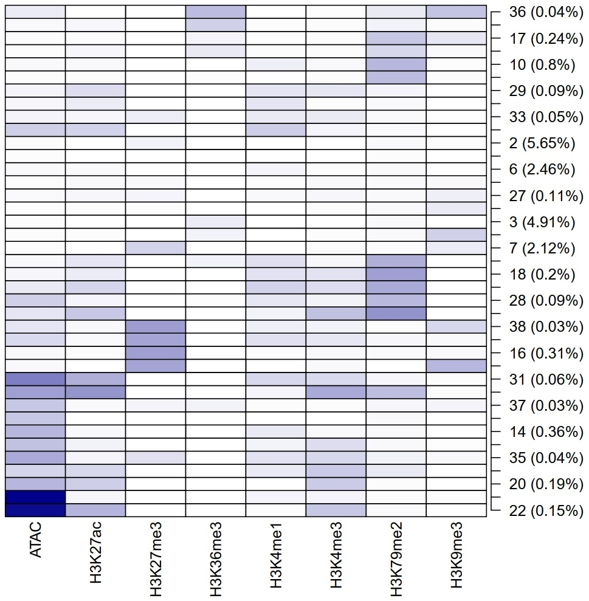
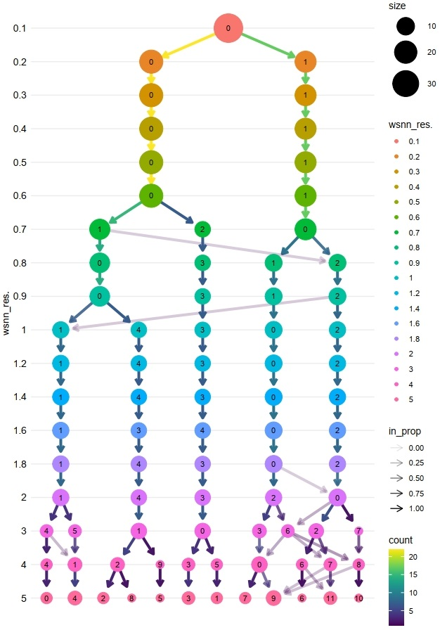

Usage Manual
============

.. contents:: 
    :local:
    :depth: 3

1. Installation
"""""""""""""""

The chromIDEAS has been upon on the conda platform, allowing for one-click installation via conda:

.. code-block:: sh

    conda install fatyang::chromideas

2. Test Data
""""""""""""

We provide various epigenetic signal data from human umbilical cord blood HSPC cells (CD34+) and human leukemia cell line (THP1). For the convenience of calculation, we only use the data on **chr1**.

The test data can be downloaded through the following link:

.. code-block:: sh

  $ wget -U "Mozilla/5.0 (X11; Linux x86_64; rv:109.0) Gecko/20100101 Firefox/115.0" -c "https://figshare.com/ndownloader/files/56572916" -O chr1_cd34_thp1.tar.gz
  $ tar xzf chr1_cd34_thp1.tar.gz

3. Running chromIDEAS
"""""""""""""""""""""

3.1 Input Preparation
---------------------

3.1.1 metadata.txt
******************

When running chromatin state segmentation, we need to provide a metadata file to inform the program of the files corresponding to different epigenetic signals in different cells.

We will create a new file named `metadata.txt`, and then add the following content to it::

  cd34	ATAC	rep1	./1.raw_bw/cd34_ATAC_rep1_PE.bw
  cd34	ATAC	rep2	./1.raw_bw/cd34_ATAC_rep2_PE.bw
  thp1	ATAC	rep3	./1.raw_bw/thp1_ATAC_rep3_PE.bw
  thp1	ATAC	rep4	./1.raw_bw/thp1_ATAC_rep4_PE.bw
  cd34	H3K4me1	rep1	./1.raw_bw/cd34_H3K4me1_rep1_SE.bw	./1.raw_bw/cd34_input_rep2_SE.bw
  cd34	H3K4me1	rep2	./1.raw_bw/cd34_H3K4me1_rep2_SE.bw	./1.raw_bw/cd34_input_rep3_SE.bw
  cd34	H3K4me1	rep3	./1.raw_bw/cd34_H3K4me1_rep3_SE.bw	./1.raw_bw/cd34_input_rep4_SE.bw
  cd34	H3K4me1	rep4	./1.raw_bw/cd34_H3K4me1_rep4_SE.bw	./1.raw_bw/cd34_input_rep10_SE.bw
  cd34	H3K4me1	rep5	./1.raw_bw/cd34_H3K4me1_rep5_SE.bw	./1.raw_bw/cd34_input_rep5_SE.bw
  cd34	H3K4me1	rep6	./1.raw_bw/cd34_H3K4me1_rep6_SE.bw	./1.raw_bw/cd34_input_rep8_SE.bw
  cd34	H3K4me1	rep7	./1.raw_bw/cd34_H3K4me1_rep7_SE.bw	./1.raw_bw/cd34_input_rep1_SE.bw
  cd34	H3K4me1	rep8	./1.raw_bw/cd34_H3K4me1_rep8_SE.bw	./1.raw_bw/cd34_input_rep11_SE.bw
  cd34	H3K4me1	rep9	./1.raw_bw/cd34_H3K4me1_rep9_SE.bw	./1.raw_bw/cd34_input_rep15_SE.bw
  thp1	H3K4me1	rep2	./1.raw_bw/thp1_H3K4me1_rep2_PE.bw	./1.raw_bw/thp1_input_rep4_PE.bw
  thp1	H3K4me1	rep3	./1.raw_bw/thp1_H3K4me1_rep3_PE.bw	./1.raw_bw/thp1_input_rep4_PE.bw
  cd34	H3K4me3	rep10	./1.raw_bw/cd34_H3K4me3_rep10_SE.bw	./1.raw_bw/cd34_input_rep11_SE.bw
  cd34	H3K4me3	rep1	./1.raw_bw/cd34_H3K4me3_rep1_SE.bw	./1.raw_bw/cd34_input_rep2_SE.bw
  cd34	H3K4me3	rep2	./1.raw_bw/cd34_H3K4me3_rep2_SE.bw	./1.raw_bw/cd34_input_rep3_SE.bw
  cd34	H3K4me3	rep3	./1.raw_bw/cd34_H3K4me3_rep3_SE.bw	./1.raw_bw/cd34_input_rep8_SE.bw
  cd34	H3K4me3	rep4	./1.raw_bw/cd34_H3K4me3_rep4_SE.bw	./1.raw_bw/cd34_input_rep9_SE.bw
  cd34	H3K4me3	rep5	./1.raw_bw/cd34_H3K4me3_rep5_SE.bw	./1.raw_bw/cd34_input_rep1_SE.bw
  cd34	H3K4me3	rep6	./1.raw_bw/cd34_H3K4me3_rep6_SE.bw	./1.raw_bw/cd34_input_rep4_SE.bw
  cd34	H3K4me3	rep7	./1.raw_bw/cd34_H3K4me3_rep7_SE.bw	./1.raw_bw/cd34_input_rep12_SE.bw
  cd34	H3K4me3	rep8	./1.raw_bw/cd34_H3K4me3_rep8_SE.bw	./1.raw_bw/cd34_input_rep6_SE.bw
  cd34	H3K4me3	rep9	./1.raw_bw/cd34_H3K4me3_rep9_SE.bw	./1.raw_bw/cd34_input_rep10_SE.bw
  cd34	H3K4me3	rep11	./1.raw_bw/cd34_H3K4me3_rep11_PE.bw	./1.raw_bw/cd34_input_rep19_PE.bw
  cd34	H3K4me3	rep12	./1.raw_bw/cd34_H3K4me3_rep12_PE.bw	./1.raw_bw/cd34_input_rep20_PE.bw
  cd34	H3K4me3	rep13	./1.raw_bw/cd34_H3K4me3_rep13_SE.bw
  thp1	H3K4me3	rep2	./1.raw_bw/thp1_H3K4me3_rep2_PE.bw	./1.raw_bw/thp1_input_rep4_PE.bw
  thp1	H3K4me3	rep3	./1.raw_bw/thp1_H3K4me3_rep3_PE.bw	./1.raw_bw/thp1_input_rep4_PE.bw
  cd34	H3K9me3	rep1	./1.raw_bw/cd34_H3K9me3_rep1_SE.bw	./1.raw_bw/cd34_input_rep4_SE.bw
  cd34	H3K9me3	rep2	./1.raw_bw/cd34_H3K9me3_rep2_SE.bw	./1.raw_bw/cd34_input_rep1_SE.bw
  cd34	H3K9me3	rep3	./1.raw_bw/cd34_H3K9me3_rep3_SE.bw	./1.raw_bw/cd34_input_rep12_SE.bw
  cd34	H3K9me3	rep4	./1.raw_bw/cd34_H3K9me3_rep4_SE.bw	./1.raw_bw/cd34_input_rep6_SE.bw
  cd34	H3K9me3	rep5	./1.raw_bw/cd34_H3K9me3_rep5_SE.bw	./1.raw_bw/cd34_input_rep5_SE.bw
  cd34	H3K9me3	rep6	./1.raw_bw/cd34_H3K9me3_rep6_SE.bw	./1.raw_bw/cd34_input_rep8_SE.bw
  cd34	H3K9me3	rep7	./1.raw_bw/cd34_H3K9me3_rep7_SE.bw	./1.raw_bw/cd34_input_rep2_SE.bw
  cd34	H3K9me3	rep8	./1.raw_bw/cd34_H3K9me3_rep8_SE.bw	./1.raw_bw/cd34_input_rep3_SE.bw
  cd34	H3K9me3	rep9	./1.raw_bw/cd34_H3K9me3_rep9_SE.bw	./1.raw_bw/cd34_input_rep10_SE.bw
  thp1	H3K9me3	rep3	./1.raw_bw/thp1_H3K9me3_rep3_PE.bw	./1.raw_bw/thp1_input_rep4_PE.bw
  thp1	H3K9me3	rep4	./1.raw_bw/thp1_H3K9me3_rep4_PE.bw	./1.raw_bw/thp1_input_rep4_PE.bw
  cd34	H3K27ac	rep3	./1.raw_bw/cd34_H3K27ac_rep3_SE.bw	./1.raw_bw/cd34_input_rep18_SE.bw
  cd34	H3K27ac	rep4	./1.raw_bw/cd34_H3K27ac_rep4_SE.bw	./1.raw_bw/cd34_input_rep5_SE.bw
  cd34	H3K27ac	rep5	./1.raw_bw/cd34_H3K27ac_rep5_SE.bw	./1.raw_bw/cd34_input_rep15_SE.bw
  thp1	H3K27ac	rep2	./1.raw_bw/thp1_H3K27ac_rep2_PE.bw	./1.raw_bw/thp1_input_rep4_PE.bw
  thp1	H3K27ac	rep3	./1.raw_bw/thp1_H3K27ac_rep3_PE.bw	./1.raw_bw/thp1_input_rep4_PE.bw
  cd34	H3K27me3	rep11	./1.raw_bw/cd34_H3K27me3_rep11_SE.bw	./1.raw_bw/cd34_input_rep18_SE.bw
  cd34	H3K27me3	rep1	./1.raw_bw/cd34_H3K27me3_rep1_SE.bw	./1.raw_bw/cd34_input_rep2_SE.bw
  cd34	H3K27me3	rep2	./1.raw_bw/cd34_H3K27me3_rep2_SE.bw	./1.raw_bw/cd34_input_rep8_SE.bw
  cd34	H3K27me3	rep3	./1.raw_bw/cd34_H3K27me3_rep3_SE.bw	./1.raw_bw/cd34_input_rep1_SE.bw
  cd34	H3K27me3	rep4	./1.raw_bw/cd34_H3K27me3_rep4_SE.bw	./1.raw_bw/cd34_input_rep12_SE.bw
  cd34	H3K27me3	rep5	./1.raw_bw/cd34_H3K27me3_rep5_SE.bw	./1.raw_bw/cd34_input_rep5_SE.bw
  cd34	H3K27me3	rep6	./1.raw_bw/cd34_H3K27me3_rep6_SE.bw	./1.raw_bw/cd34_input_rep6_SE.bw
  cd34	H3K27me3	rep7	./1.raw_bw/cd34_H3K27me3_rep7_SE.bw	./1.raw_bw/cd34_input_rep4_SE.bw
  cd34	H3K27me3	rep8	./1.raw_bw/cd34_H3K27me3_rep8_SE.bw	./1.raw_bw/cd34_input_rep10_SE.bw
  cd34	H3K27me3	rep9	./1.raw_bw/cd34_H3K27me3_rep9_SE.bw	./1.raw_bw/cd34_input_rep11_SE.bw
  cd34	H3K27me3	rep12	./1.raw_bw/cd34_H3K27me3_rep12_PE.bw	./1.raw_bw/cd34_input_rep19_PE.bw
  cd34	H3K27me3	rep13	./1.raw_bw/cd34_H3K27me3_rep13_PE.bw	./1.raw_bw/cd34_input_rep20_PE.bw
  cd34	H3K27me3	rep14	./1.raw_bw/cd34_H3K27me3_rep14_PE.bw	./1.raw_bw/cd34_input_rep21_PE.bw
  cd34	H3K27me3	rep15	./1.raw_bw/cd34_H3K27me3_rep15_SE.bw
  thp1	H3K27me3	rep3	./1.raw_bw/thp1_H3K27me3_rep3_PE.bw	./1.raw_bw/thp1_input_rep4_PE.bw
  thp1	H3K27me3	rep4	./1.raw_bw/thp1_H3K27me3_rep4_PE.bw	./1.raw_bw/thp1_input_rep4_PE.bw
  cd34	H3K36me3	rep10	./1.raw_bw/cd34_H3K36me3_rep10_SE.bw	./1.raw_bw/cd34_input_rep18_SE.bw
  cd34	H3K36me3	rep1	./1.raw_bw/cd34_H3K36me3_rep1_SE.bw	./1.raw_bw/cd34_input_rep1_SE.bw
  cd34	H3K36me3	rep2	./1.raw_bw/cd34_H3K36me3_rep2_SE.bw	./1.raw_bw/cd34_input_rep4_SE.bw
  cd34	H3K36me3	rep3	./1.raw_bw/cd34_H3K36me3_rep3_SE.bw	./1.raw_bw/cd34_input_rep12_SE.bw
  cd34	H3K36me3	rep4	./1.raw_bw/cd34_H3K36me3_rep4_SE.bw	./1.raw_bw/cd34_input_rep5_SE.bw
  cd34	H3K36me3	rep6	./1.raw_bw/cd34_H3K36me3_rep6_SE.bw	./1.raw_bw/cd34_input_rep2_SE.bw
  cd34	H3K36me3	rep7	./1.raw_bw/cd34_H3K36me3_rep7_SE.bw	./1.raw_bw/cd34_input_rep3_SE.bw
  cd34	H3K36me3	rep8	./1.raw_bw/cd34_H3K36me3_rep8_SE.bw	./1.raw_bw/cd34_input_rep10_SE.bw
  cd34	H3K36me3	rep9	./1.raw_bw/cd34_H3K36me3_rep9_SE.bw	./1.raw_bw/cd34_input_rep11_SE.bw
  thp1	H3K36me3	rep1	./1.raw_bw/thp1_H3K36me3_rep1_PE.bw	./1.raw_bw/thp1_mock_rep1_PE.bw
  thp1	H3K36me3	rep2	./1.raw_bw/thp1_H3K36me3_rep2_PE.bw	./1.raw_bw/thp1_mock_rep1_PE.bw
  thp1	H3K36me3	rep3	./1.raw_bw/thp1_H3K36me3_rep3_PE.bw	./1.raw_bw/thp1_mock_rep2_PE.bw
  thp1	H3K36me3	rep4	./1.raw_bw/thp1_H3K36me3_rep4_PE.bw	./1.raw_bw/thp1_mock_rep2_PE.bw
  cd34	H3K79me2	rep2	./1.raw_bw/cd34_H3K79me2_rep2_PE.bw	./1.raw_bw/cd34_input_rep19_PE.bw
  cd34	H3K79me2	rep3	./1.raw_bw/cd34_H3K79me2_rep3_PE.bw	./1.raw_bw/cd34_input_rep20_PE.bw
  cd34	H3K79me2	rep4	./1.raw_bw/cd34_H3K79me2_rep4_PE.bw	./1.raw_bw/cd34_input_rep21_PE.bw
  thp1	H3K79me2	rep1	./1.raw_bw/thp1_H3K79me2_rep1_PE.bw	./1.raw_bw/thp1_input_rep3_PE.bw

Each row represents a dataset of epigenetic modification signals for cells, separated by "tab". The format is described as follows:

- col1: Cell type
- col2: Epigenetic modification type
- col3: biological replicate
- col4: Address of the experimental group dataset
- col5: (Optional) Corresponding control dataset address

3.1.2 Genome Length
*******************

Since we only used data from chr1 here, we need to specify the specific genome length.

We can create a new file, name it `chr1.txt`, and fill it with the following content::

  chr1	248956422

Each line represents the length of a piece of chromatin, separated by "tab". The format is described as follows:

- col1: chromosome number
- col2: Chromosome length

3.1.3 Blacklist (optional)
**************************

We can exclude some potentially problematic areas by specifying a blacklist file. The specific file can be downloaded as specified below:

.. code-block:: sh

    $ wget https://github.com/Boyle-Lab/Blacklist/raw/master/lists/hg38-blacklist.v2.bed.gz
    $ gunzip hg38-blacklist.v2.bed.gz

3.1.4 File management
*********************

Before starting the operation, let's organize the relevant files that have been prepared:

.. code-block:: sh

    $ mkdir -p 0.sup_dat 1.raw_bw
    $ mv metadata.txt chr1.txt hg38-blacklist.v2.bed 0.sup_dat
    $ mv *.bw 1.raw_bw
    $ tree
    .
    ├── 0.sup_dat
    │   ├── chr1.txt
    │   ├── hg38-blacklist.v2.bed
    │   └── metadata.txt
    ├── 1.raw_bw
    │   ├── cd34_ATAC_rep1_PE.bw
    │   ├── cd34_ATAC_rep2_PE.bw
    │   ├── cd34_H3K27ac_rep3_SE.bw
    │   ├── cd34_H3K27ac_rep4_SE.bw
    ......
    │   ├── thp1_input_rep4_PE.bw
    │   ├── thp1_mock_rep1_PE.bw
    │   └── thp1_mock_rep2_PE.bw
    └── chr1_cd34_thp1.tar.gz

3.2 Chromatin State Segmentation
--------------------------------

3.2.1 One-command execution
***************************

We can use the following command to obtain the chromatin state results with one click:

.. code-block:: sh

    $ time chromIDEAS -m 0.sup_dat/metadata.txt -o 3.one_key_CS_Segmentation/ -b 200 -g 0.sup_dat/chr1.txt -n hg38_chr1 -B 0.sup_dat/hg38-blacklist.v2.bed -c -d chr1 -p 20
    Process (1) genomeWindows done successfully.
    ------------------------------------------------------------------------
    
    Now process (2) bigWig2bedGraph.
    The /share/home/fatyang/0.Test/10.chromIDEAS/3.one_key_CS_Segmentation/1.bigWig2bedGraph directory is not exist. The program will create it.
    ################# Multiple mode #################
    /share/home/fatyang/0.Test/10.chromIDEAS/1.raw_bw/cd34_H3K27me3_rep13_PE.bw has been converted to bedgraph format succussfully.
    /share/home/fatyang/0.Test/10.chromIDEAS/1.raw_bw/cd34_H3K27ac_rep5_SE.bw has been converted to bedgraph format succussfully.
    /share/home/fatyang/0.Test/10.chromIDEAS/1.raw_bw/cd34_H3K27me3_rep8_SE.bw has been converted to bedgraph format succussfully.
    ...
    All bigWig files have been convert to bedGraph.
    Process (2) bigWig2bedGraph done successfully.
    ------------------------------------------------------------------------
    
    The /share/home/fatyang/0.Test/10.chromIDEAS/3.one_key_CS_Segmentation/2.s3v2Norm directory is not exist. The program will create it.
    Now process (3) s3v2norm.
    ########################## s3v2Norm Start ##########################
    [1] "/share/home/fatyang/0.Test/10.chromIDEAS/3.one_key_CS_Segmentation/1.bigWig2bedGraph/cd34.H3K9me3.rep1.ip.idsort.bedgraph.gz"
    [1] "/share/home/fatyang/0.Test/10.chromIDEAS/3.one_key_CS_Segmentation/1.bigWig2bedGraph/cd34.H3K79me2.rep2.ip.idsort.bedgraph.gz"
    [1] "/share/home/fatyang/0.Test/10.chromIDEAS/3.one_key_CS_Segmentation/1.bigWig2bedGraph/cd34.H3K36me3.rep10.ip.idsort.bedgraph.gz"
    ...
    1.Get cpk cbg allpk average_sig done
    2.S3norm average across marks done
            3.S3V2 across samples   ATAC done
            3.S3V2 across samples   H3K27ac done
            3.S3V2 across samples   H3K27me3 done
            3.S3V2 across samples   H3K36me3 done
            3.S3V2 across samples   H3K4me1 done
            3.S3V2 across samples   H3K4me3 done
            3.S3V2 across samples   H3K79me2 done
            3.S3V2 across samples   H3K9me3 done
    3.S3V2 across samples with same mk done
    4.S3V2 across CT samples done
    5.Get NBP for S3V2 normalized data done
    All bedGraph files have been convert to bigWig.
    6.Convert the bedgraph file into bigWig format.
    ########################## s3v2Norm End ##########################
    
    Summary for normalization:
    Ready to show Summary: 3s
    Ready to show Summary: 2s
    Ready to show Summary: 1s
    #=============================================Summary for normalization=============================================#
    ############# 1: get cpk cbg allpk average_sig #############
    Nothing requiring additional attention
    
    
    ############# 2: S3norm average across marks #############
    The normalization parameters (norm=A*raw^B):
            1) ATAC:
                    Mean_ratio           S3norm_B            S3norm_A
                    0.31912402579647464  0.6911416007650284  0.5208180030840445
            2) H3K27ac:
                    Mean_ratio          S3norm_B            S3norm_A
                    0.2642206363218819  0.6683547414300661  0.5435931404498152
            3) H3K27me3:
                    Mean_ratio          S3norm_B            S3norm_A
                    0.4239141842940278  1.0985441458588523  0.4174344884621977
            4) H3K36me3:
                    Mean_ratio          S3norm_B            S3norm_A
                    0.5963609714221206  1.0686476970950924  0.6252879289145848
            5) H3K4me1:
                    Mean_ratio          S3norm_B            S3norm_A
                    0.4325845586543525  0.9183362183254749  0.5464312537007742
            6) H3K4me3:
                    Mean_ratio           S3norm_B           S3norm_A
                    0.42192289933009874  0.665722690663896  0.720874862499352
            7) H3K79me2:
                    Mean_ratio           S3norm_B           S3norm_A
                    0.20716204795844023  0.854490378839077  0.2992704109344474
            8) H3K9me3:
                    Mean_ratio           S3norm_B            S3norm_A
                    0.49297130091515795  1.0498449905490717  0.4729004821135292
    
    
    ############# 3: S3V2 across samples with same mk #############
    The normalization parameters:
    norm_dat = norm_pk + norm_bg
            1) cd34_rep10.H3K36me3.S3V2.bedgraph:
                    Pk region normalization parameters [exponential regression: norm=(2^A)*(raw^B)]:
                            pk_b               pk_a
                            0.860268522487943  0
                    Bg region normalization parameters [linear regression: norm=B*raw+A]:
                            bg_b               bg_a
                            0.379774849916617  -0.054080182987012
            2) cd34_rep10.H3K4me3.S3V2.bedgraph:
                    Pk region normalization parameters [exponential regression: norm=(2^A)*(raw^B)]:
                            pk_b               pk_a
                            0.831459440130634  0
                    Bg region normalization parameters [linear regression: norm=B*raw+A]:
                            bg_b               bg_a
                            0.831817269539945  -0.0950225927820069
            3) cd34_rep11.H3K27me3.S3V2.bedgraph:
                    Pk region normalization parameters [exponential regression: norm=(2^A)*(raw^B)]:
                            pk_b               pk_a
                            0.937802347054138  0
                    Bg region normalization parameters [linear regression: norm=B*raw+A]:
                            bg_b               bg_a
                            0.788937931828074  -0.56781334660776
    ...
    
    
    ############# 4: S3V2 across CT samples #############
    The normalization parameters [linear regression: norm=B*raw+A]:
            1) cd34.ATAC.rep1.ctrl.idsort.bedgraph.gz.norm.bedgraph:
                    B  A
                    1  0
            2) cd34.ATAC.rep2.ctrl.idsort.bedgraph.gz.norm.bedgraph:
                    B  A
                    1  0
            3) cd34.H3K27ac.rep3.ctrl.idsort.bedgraph.gz.norm.bedgraph:
                    B                 A
                    2.08476397079908  -8.09980879317118
    ...
    
    
    ############# 5: Get NBP for S3V2 normalized data #############
    Fit the s3v2 norm data to NB model:
            1) The normalization parameters for average signal of ATAC:
                    AVEmat_cbg_prob    AVEmat_cbg_size   scale_down
                    0.903295995216867  8.72511681090712  1
            2) The normalization parameters for average signal of H3K27ac:
                    AVEmat_cbg_prob    AVEmat_cbg_size   scale_down
                    0.839476840723447  9.03072014304272  1
            3) The normalization parameters for average signal of H3K27me3:
                    AVEmat_cbg_prob    AVEmat_cbg_size   scale_down
                    0.902594813746805  17.7791989962796  1
            4) The normalization parameters for average signal of H3K36me3:
                    AVEmat_cbg_prob    AVEmat_cbg_size   scale_down
                    0.760129737927078  7.60914042205538  1
            5) The normalization parameters for average signal of H3K4me1:
                    AVEmat_cbg_prob    AVEmat_cbg_size   scale_down
                    0.571775852101361  3.82876573811324  1
            6) The normalization parameters for average signal of H3K4me3:
                    AVEmat_cbg_prob   AVEmat_cbg_size   scale_down
                    0.57108169816322  2.68410297948551  1
            7) The normalization parameters for average signal of H3K79me2:
                    AVEmat_cbg_prob    AVEmat_cbg_size   scale_down
                    0.733551180969329  3.71929718967958  1
            8) The normalization parameters for average signal of H3K9me3:
                    AVEmat_cbg_prob    AVEmat_cbg_size   scale_down
                    0.937901568499601  22.8114694786224  1
    
    
    Process (3) s3v2Norm done successfully.
    ------------------------------------------------------------------------
    
    
    Now process (4) mergeBedgraph.
    ################# Multiple mode #################
    /share/home/fatyang/0.Test/10.chromIDEAS/3.one_key_CS_Segmentation/2.s3v2Norm/chr1_bws_NBP/cd34_rep1.H3K36me3.S3V2.bedgraph.NBP.bedgraph.bw has been converted to bedgraph format succussfully.
    /share/home/fatyang/0.Test/10.chromIDEAS/3.one_key_CS_Segmentation/2.s3v2Norm/chr1_bws_NBP/cd34_rep11.H3K27me3.S3V2.bedgraph.NBP.bedgraph.bw has been converted to bedgraph format succussfully.
    /share/home/fatyang/0.Test/10.chromIDEAS/3.one_key_CS_Segmentation/2.s3v2Norm/chr1_bws_NBP/cd34_rep12.H3K4me3.S3V2.bedgraph.NBP.bedgraph.bw has been converted to bedgraph format succussfully.
    ...
    All bigWig files have been convert to bedGraph.
    Process (4) mergeBedgraph done successfully.
    ------------------------------------------------------------------------
    
    Now process (5) ideasCS.
    
    real    46m48.756s
    user    742m4.707s
    sys     13m51.547s
    Process (5) ideasCS done successfully.
    ------------------------------------------------------------------------
    
    
    real    60m4.404s
    user    876m7.955s
    sys     22m45.722s

3.2.2 Step-by-step
******************

We can also proceed in three steps.

**(1) Normalization：**

.. code-block:: sh

    $ time s3v2Norm -b 200 -o 2.CS_Segmentation/ -m 0.sup_dat/metadata.txt -n hg38_chr1 -c -d chr1 -p 20 -g 0.sup_dat/chr1.txt -B 0.sup_dat/hg38-blacklist.v2.bed
    Now process (1) genomeWindows.
    Process (1) genomeWindows done successfully.
    ------------------------------------------------------------------------
    
    Now process (2) bigWig2bedGraph.
    The /share/home/fatyang/0.Test/10.chromIDEAS/2.CS_Segmentation/1.bigWig2bedGraph directory is not exist. The program will create it.
    ################# Multiple mode #################
    /share/home/fatyang/0.Test/10.chromIDEAS/1.raw_bw/cd34_H3K27me3_rep5_SE.bw has been converted to bedgraph format succussfully.
    /share/home/fatyang/0.Test/10.chromIDEAS/1.raw_bw/cd34_H3K36me3_rep10_SE.bw has been converted to bedgraph format succussfully.
    /share/home/fatyang/0.Test/10.chromIDEAS/1.raw_bw/cd34_H3K27me3_rep12_PE.bw has been converted to bedgraph format succussfully.
    ...
    
    All bigWig files have been convert to bedGraph.
    Process (2) bigWig2bedGraph done successfully.
    ------------------------------------------------------------------------
    
    The /share/home/fatyang/0.Test/10.chromIDEAS/2.CS_Segmentation/2.s3v2Norm directory is not exist. The program will create it.
    Now process (3) s3v2norm.
    ########################## s3v2Norm Start ##########################
    [1] "/share/home/fatyang/0.Test/10.chromIDEAS/2.CS_Segmentation/1.bigWig2bedGraph/cd34.H3K9me3.rep1.ip.idsort.bedgraph.gz"
    [1] "/share/home/fatyang/0.Test/10.chromIDEAS/2.CS_Segmentation/1.bigWig2bedGraph/cd34.H3K36me3.rep10.ip.idsort.bedgraph.gz"
    [1] "/share/home/fatyang/0.Test/10.chromIDEAS/2.CS_Segmentation/1.bigWig2bedGraph/cd34.H3K79me2.rep2.ip.idsort.bedgraph.gz"
    ...
    
    1.Get cpk cbg allpk average_sig done
    2.S3norm average across marks done
            3.S3V2 across samples   ATAC done
            3.S3V2 across samples   H3K27ac done
            3.S3V2 across samples   H3K27me3 done
            3.S3V2 across samples   H3K36me3 done
            3.S3V2 across samples   H3K4me1 done
            3.S3V2 across samples   H3K4me3 done
            3.S3V2 across samples   H3K79me2 done
            3.S3V2 across samples   H3K9me3 done
    3.S3V2 across samples with same mk done
    4.S3V2 across CT samples done
    5.Get NBP for S3V2 normalized data done
    All bedGraph files have been convert to bigWig.
    6.Convert the bedgraph file into bigWig format.
    ########################## s3v2Norm End ##########################
    
    Summary for normalization:
    Ready to show Summary: 3s
    Ready to show Summary: 2s
    Ready to show Summary: 1s
    #=============================================Summary for normalization=============================================#
    ############# 1: get cpk cbg allpk average_sig #############
    Nothing requiring additional attention
    
    
    ############# 2: S3norm average across marks #############
    The normalization parameters (norm=A*raw^B):
            1) ATAC:
                    Mean_ratio           S3norm_B            S3norm_A
                    0.31912402579647464  0.6911416007650284  0.5208180030840445
            2) H3K27ac:
                    Mean_ratio          S3norm_B            S3norm_A
                    0.2642206363218819  0.6683547414300661  0.5435931404498152
            3) H3K27me3:
                    Mean_ratio          S3norm_B            S3norm_A
                    0.4239141842940278  1.0985441458588523  0.4174344884621977
            4) H3K36me3:
                    Mean_ratio          S3norm_B            S3norm_A
                    0.5963609714221206  1.0686476970950924  0.6252879289145848
            5) H3K4me1:
                    Mean_ratio          S3norm_B            S3norm_A
                    0.4325845586543525  0.9183362183254749  0.5464312537007742
            6) H3K4me3:
                    Mean_ratio           S3norm_B           S3norm_A
                    0.42192289933009874  0.665722690663896  0.720874862499352
            7) H3K79me2:
                    Mean_ratio           S3norm_B           S3norm_A
                    0.20716204795844023  0.854490378839077  0.2992704109344474
            8) H3K9me3:
                    Mean_ratio           S3norm_B            S3norm_A
                    0.49297130091515795  1.0498449905490717  0.4729004821135292
    
    
    ############# 3: S3V2 across samples with same mk #############
    The normalization parameters:
    norm_dat = norm_pk + norm_bg
            1) cd34_rep10.H3K36me3.S3V2.bedgraph:
                    Pk region normalization parameters [exponential regression: norm=(2^A)*(raw^B)]:
                            pk_b               pk_a
                            0.860268522487943  0
                    Bg region normalization parameters [linear regression: norm=B*raw+A]:
                            bg_b               bg_a
                            0.379774849916617  -0.054080182987012
            2) cd34_rep10.H3K4me3.S3V2.bedgraph:
                    Pk region normalization parameters [exponential regression: norm=(2^A)*(raw^B)]:
                            pk_b               pk_a
                            0.831459440130634  0
                    Bg region normalization parameters [linear regression: norm=B*raw+A]:
                            bg_b               bg_a
                            0.831817269539945  -0.0950225927820069
            3) cd34_rep11.H3K27me3.S3V2.bedgraph:
                    Pk region normalization parameters [exponential regression: norm=(2^A)*(raw^B)]:
                            pk_b               pk_a
                            0.937802347054138  0
                    Bg region normalization parameters [linear regression: norm=B*raw+A]:
                            bg_b               bg_a
                            0.788937931828074  -0.56781334660776
    ...
    
    
    ############# 4: S3V2 across CT samples #############
    The normalization parameters [linear regression: norm=B*raw+A]:
            1) cd34.ATAC.rep1.ctrl.idsort.bedgraph.gz.norm.bedgraph:
                    B  A
                    1  0
            2) cd34.ATAC.rep2.ctrl.idsort.bedgraph.gz.norm.bedgraph:
                    B  A
                    1  0
            3) cd34.H3K27ac.rep3.ctrl.idsort.bedgraph.gz.norm.bedgraph:
                    B                 A
                    2.08476397079908  -8.09980879317118
    ...
    
    
    ############# 5: Get NBP for S3V2 normalized data #############
    Fit the s3v2 norm data to NB model:
            1) The normalization parameters for average signal of ATAC:
                    AVEmat_cbg_prob    AVEmat_cbg_size   scale_down
                    0.903295995216867  8.72511681090712  1
            2) The normalization parameters for average signal of H3K27ac:
                    AVEmat_cbg_prob    AVEmat_cbg_size   scale_down
                    0.839476840723447  9.03072014304272  1
            3) The normalization parameters for average signal of H3K27me3:
                    AVEmat_cbg_prob    AVEmat_cbg_size   scale_down
                    0.902594813746805  17.7791989962796  1
            4) The normalization parameters for average signal of H3K36me3:
                    AVEmat_cbg_prob    AVEmat_cbg_size   scale_down
                    0.760129737927078  7.60914042205538  1
            5) The normalization parameters for average signal of H3K4me1:
                    AVEmat_cbg_prob    AVEmat_cbg_size   scale_down
                    0.571775852101361  3.82876573811324  1
            6) The normalization parameters for average signal of H3K4me3:
                    AVEmat_cbg_prob   AVEmat_cbg_size   scale_down
                    0.57108169816322  2.68410297948551  1
            7) The normalization parameters for average signal of H3K79me2:
                    AVEmat_cbg_prob    AVEmat_cbg_size   scale_down
                    0.733551180969329  3.71929718967958  1
            8) The normalization parameters for average signal of H3K9me3:
                    AVEmat_cbg_prob    AVEmat_cbg_size   scale_down
                    0.937901568499601  22.8114694786224  1
    
    
    Process (3) s3v2Norm done successfully.
    ------------------------------------------------------------------------
    
    
    real    11m27.584s
    user    114m54.271s
    sys     6m23.810s

----------------------

For comparison, we processed the identical dataset with the same parameters using the `S3V2 software <https://github.com/guanjue/S3V2_IDEAS_ESMP>`_. Due to the maximum thread setting of 4 in S3V2, we set it to the maximum allowed (thread=4).
 
We also recorded the runtime:

.. code-block:: sh

    real    52m41.469s
    user    137m27.021s
    sys     6m52.058s

It can be seen that the chromIDEAS consumes 11m27.584s of time when running data standardization, while the original S3V2 consumes 52m41.469s when processing the same data.

**(2) Merge Replicates：**

.. code-block:: sh

    $ mkdir -p 2.CS_Segmentation/3.CS_segmentation/chr1_IDEAS_input_NB
    $ ls 2.CS_Segmentation/2.s3v2Norm/chr1_bws_NBP/*S3V2.bedgraph.NBP.bedgraph.bw | while read id
    do
        bedg=$(basename $id | sed -r "s/.bw$//g")
        echo -e "${id}\t2.CS_Segmentation/3.CS_segmentation/chr1_IDEAS_input_NB/${bedg}" >> 2.CS_Segmentation/3.CS_segmentation/chr1_IDEAS_input_NB/group.7991799.txt
    
        cell=$(basename $id | cut -d "_" -f1)
        mk=$(basename $id | cut -d "." -f2)
        echo -e "2.CS_Segmentation/3.CS_segmentation/chr1_IDEAS_input_NB/${bedg}\t2.CS_Segmentation/3.CS_segmentation/chr1_IDEAS_input_NB/${cell}.${mk}.S3V2.bedgraph.NBP.txt" >> 2.CS_Segmentation/3.CS_segmentation/chr1_IDEAS_input_NB/group.7992799.txt
    done
    
    $ bigWig2bedGraph -n hg38_chr1 -f 2.CS_Segmentation/3.CS_segmentation/chr1_IDEAS_input_NB/group.7991799.txt -p 20 -b 200
    ################# Multiple mode #################
    2.CS_Segmentation/2.s3v2Norm/chr1_bws_NBP/cd34_rep1.H3K36me3.S3V2.bedgraph.NBP.bedgraph.bw has been converted to bedgraph format succussfully.
    2.CS_Segmentation/2.s3v2Norm/chr1_bws_NBP/cd34_rep12.H3K4me3.S3V2.bedgraph.NBP.bedgraph.bw has been converted to bedgraph format succussfully.
    2.CS_Segmentation/2.s3v2Norm/chr1_bws_NBP/cd34_rep1.H3K27me3.S3V2.bedgraph.NBP.bedgraph.bw has been converted to bedgraph format succussfully.
    ...
    All bigWig files have been convert to bedGraph.
    
    $ mergeBedgraph -f 2.CS_Segmentation/3.CS_segmentation/chr1_IDEAS_input_NB/group.7992799.txt -m median -c pearson -p 20
    $ cut -f2 2.CS_Segmentation/3.CS_segmentation/chr1_IDEAS_input_NB/group.7991799.txt | xargs -n1 -i rm -rf {}
    $ cat 0.sup_dat/metadata.txt | while read cell mk id exp ct
    do
        echo "${cell} ${mk} 2.CS_Segmentation/3.CS_segmentation/chr1_IDEAS_input_NB/${cell}.${mk}.S3V2.bedgraph.NBP.txt"
    done | sort -u > 2.CS_Segmentation/3.CS_segmentation/chr1_IDEAS_input_NB/meta.txt
    
    $ rm -rf 2.CS_Segmentation/3.CS_segmentation/chr1_IDEAS_input_NB/group.799[12]799.txt

**(3) State Segmentation：**

.. code-block:: sh

    $ ideasCS -m 2.CS_Segmentation/3.CS_segmentation/chr1_IDEAS_input_NB/meta.txt -o 2.CS_Segmentation/4.chr1_IDEAS_output -d chr1 -p 20
    
    real    44m22.538s
    user    712m10.945s
    sys     11m7.006s

----------------------

For comparison, we processed the identical dataset with the same parameters using the `S3V2 software <https://github.com/guanjue/S3V2_IDEAS_ESMP>`_. Due to the maximum thread setting of 4 in S3V2, we set it to the maximum allowed (thread=4).

We also recorded the runtime:

.. code-block:: sh

    real    134m41.655s
    user    797m32.504s
    sys     19m35.703s

It can be seen that the chromIDEAS consumes 44m22.538s of time when running state segmentation, while the original S3V2 consumes 134m41.655s when processing the same data.

3.2.3 Result Interpretation
***************************

It is important to note that the chromatin state identification results obtained from ``chromIDEAS`` **are not perfectly reproducible between different runs**, but this does not affect the overall biological patterns.

This is because the underlying ``IDEAS`` tool randomly samples different genomic regions during chromatin state calculation.

----------------------

For details on this behavior, please refer to the original publication:

- DOI: 10.1093/nar/gkx659

The chromatin state segmentation process generates three main output files, as shown below:

.. code-block:: sh

    $ tree 2.CS_Segmentation/4.chr1_IDEAS_output/
    2.CS_Segmentation/4.chr1_IDEAS_output/
    ├── chr1.emission.pdf
    ├── chr1.emission.txt
    ├── chr1.state
    ├── err.log
    └── std.log
    
    1 directory, 5 files
    
    $ wc 2.CS_Segmentation/4.chr1_IDEAS_output/chr1.emission.txt
      40  400 6431 chr1.emission.txt

- **chr1.state**: Chromatin state distribution across the genomes of different cell types.
- **chr1.emission.txt**: Definitions of chromatin states, recording the probability of each epigenetic signal appearing in each state. The example shows 39 distinct chromatin states.
- **chr1.emission.pdf**: Visual representation of the data in ``chr1.emission.txt``.

3.3 Functional Clustering of Chromatin State
--------------------------------------------

.. code-block:: sh

    $ mkdir -p 4.CSC
    $ chromIDEAS_CSC \
    -i 2.CS_Segmentation/4.chr1_IDEAS_output/chr1.state \
    -e 2.CS_Segmentation/4.chr1_IDEAS_output/chr1.emission.txt \
    -r chr1.gtf \
    -o 4.CSC/4.CSC \
    -f gtf \
    -t tx \
    -O 0.1 \
    -m 3 \
    -R "0.1-0.9-0.1,1-1.8-0.2,2-5-1"
    (1) Now calculate the region-segment-wise CS occupancy matrix ...
    Warning messages:
    1: package ‘qs’ was built under R version 4.3.3
    2: package ‘GenomicFeatures’ was built under R version 4.3.2
    3: package ‘BiocGenerics’ was built under R version 4.3.2
    4: package ‘S4Vectors’ was built under R version 4.3.3
    5: package ‘IRanges’ was built under R version 4.3.3
    6: package ‘GenomeInfoDb’ was built under R version 4.3.2
    7: package ‘GenomicRanges’ was built under R version 4.3.3
    8: package ‘AnnotationDbi’ was built under R version 4.3.2
    9: package ‘Biobase’ was built under R version 4.3.3
    Import genomic features from the file as a GRanges object ... OK
    Prepare the 'metadata' data frame ... OK
    Make the TxDb object ... OK
    Now we are going to find the non-overlapping transcriptions for downstream analysis.
    |----------------------------------------------------------------------------------------------------|
    |*starting worker pid=21161 on localhost:11712 at 16:16:15.554
    starting worker pid=21160 on localhost:11712 at 16:16:15.562
    starting worker pid=21162 on localhost:11712 at 16:16:15.562
    starting worker pid=21159 on localhost:11712 at 16:16:15.568
    ***************************************************************************************************|
    There are 3253 non-overlapping transcripts for downstream analysis
    To ensure that after being divided into 10 segments, each segment contains at least a independent CS label, we filter out transcriptions with length <= 10 bins
    Removing 2133 transcriptions, there are total 1120 transcriptions for downstream analysis
    Warning message:
    In .get_cds_IDX(mcols0$type, mcols0$phase) :
      The "phase" metadata column contains non-NA values for features of type
      stop_codon. This information was ignored.
    [1] "G1"
    [1] "G2"
    [1] "G3"
    [1] "G4"
    [1] "G5"
    [1] "G6"
    [1] "G7"
    [1] "G8"
    [1] "G9"
    [1] "G10"
    |----------------------------------------------------------------------------------------------------|
    |*starting worker pid=21449 on localhost:11712 at 16:16:18.888
    starting worker pid=21451 on localhost:11712 at 16:16:18.908
    starting worker pid=21450 on localhost:11712 at 16:16:18.919
    starting worker pid=21452 on localhost:11712 at 16:16:18.941
    ***************************************************************************************************|
    |----------------------------------------------------------------------------------------------------|
    |*starting worker pid=21745 on localhost:11712 at 16:16:22.362
    starting worker pid=21744 on localhost:11712 at 16:16:22.364
    starting worker pid=21742 on localhost:11712 at 16:16:22.383
    starting worker pid=21743 on localhost:11712 at 16:16:22.387
    ***************************************************************************************************|
    Now calclulate the HITs for cd34 dat:
    |------------|
    |*starting worker pid=22060 on localhost:11712 at 16:16:25.891
    starting worker pid=22063 on localhost:11712 at 16:16:25.910
    starting worker pid=22062 on localhost:11712 at 16:16:25.911
    starting worker pid=22061 on localhost:11712 at 16:16:25.927
    ***********|
    Now calclulate the HITs for thp1 dat:
    |------------|
    |*starting worker pid=22362 on localhost:11712 at 16:16:29.035
    starting worker pid=22360 on localhost:11712 at 16:16:29.049
    starting worker pid=22361 on localhost:11712 at 16:16:29.056
    starting worker pid=22363 on localhost:11712 at 16:16:29.060
    ***********|
    (2) Now identify functionally coherent chromatin state clusters (CSCs) ...
    Warning messages:
    1: package ‘qs’ was built under R version 4.3.3
    2: package ‘Seurat’ was built under R version 4.3.3
    3: package ‘SeuratObject’ was built under R version 4.3.3
    Warning: Data is of class data.frame. Coercing to dgCMatrix.
    Warning: Data is of class data.frame. Coercing to dgCMatrix.
    Centering and scaling data matrix
      |======================================================================| 100%
    Centering and scaling data matrix
      |======================================================================| 100%
    Calculating cell-specific modality weights
    Finding 4 nearest neighbors for each modality.
    Calculating kernel bandwidths
    Finding multimodal neighbors
    Constructing multimodal KNN graph
    Constructing multimodal SNN graph
    Warning: The default method for RunUMAP has changed from calling Python UMAP via reticulate to the R-native UWOT using the cosine metric
    To use Python UMAP via reticulate, set umap.method to 'umap-learn' and metric to 'correlation'
    This message will be shown once per session
    16:16:48 UMAP embedding parameters a = 0.9922 b = 1.112
    16:16:49 Commencing smooth kNN distance calibration using 1 thread with target n_neighbors = 4
    16:16:49 Initializing from normalized Laplacian + noise (using RSpectra)
    16:16:49 Commencing optimization for 500 epochs, with 196 positive edges
    Using method 'umap'
    0%   10   20   30   40   50   60   70   80   90   100%
    [----|----|----|----|----|----|----|----|----|----|
    **************************************************|
    16:16:49 Optimization finished
    Warning message:
    Key ‘PC_’ taken, using ‘apca_’ instead

After execution, the following files will be generated:

.. code-block:: sh

    $ tree 4.CSC/
    4.CSC/
    ├── 4.CSC.2000_Highly_Informative_Txs.qs
    ├── 4.CSC.merge.cluster.csv
    ├── 4.CSC.merge.clustree.pdf
    ├── 4.CSC.merge.CS_Distance.qs
    ├── 4.CSC.tx_Body_10segments_based_on_CSPercentage.cd34.qs
    └── 4.CSC.tx_Body_10segments_based_on_CSPercentage.thp1.qs
    
    1 directory, 6 files

Description of the output files:

- **4.CSC.merge.cluster.csv**: Records the clustering results of CSCs at different CS clustering resolutions.
- **4.CSC.merge.clustree.pdf**: A combined visualization of clustering results across multiple resolutions, as shown in the figure below.
- **4.CSC.2000_Highly_Informative_Txs.qs**: The list of 2000 highly informative transcripts (HITs) selected for analysis, stored in QS format.
- **4.CSC.merge.CS_Distance.qs**: Pairwise distance values between all chromatin states within the WNN space, stored in QS format for downstream differential chromatin state cluster gene (DCSCG) analysis.
- **4.CSC.tx_Body_10segments_based_on_CSPercentage.cd34.qs**: In CD34 cells, a matrix representing the distribution of all chromatin states across the 2000 HITs, segmented into 10 equal parts along each transcript body.
- **4.CSC.tx_Body_10segments_based_on_CSPercentage.thp1.qs**: In THP1 cells, a matrix representing the distribution of all chromatin states across the 2000 HITs, segmented into 10 equal parts along each transcript body.

**Clustering Results:**

The **39 chromatin states are grouped into 5 major CSCs**. At a resolution of 2.0, the clustering results are most stable while maintaining a relatively high resolution.

3.4 Chromatin State Distribution Visualization
----------------------------------------------

.. code-block:: sh

    # wget https://ftp.ebi.ac.uk/pub/databases/gencode/Gencode_human/release_40/gencode.v40.annotation.gtf.gz
    # gunzip gencode.v40.annotation.gtf.gz
    
    $ awk -F "\t" '{if($1 == "chr1") {print $0}}' /share/home/fatyang/Genomes/GENCODE/Human/hg38/gtf/gencode.v40.annotation.gtf > chr1.gtf
    $ plotCSprofile TSS -i 2.CS_Segmentation/4.chr1_IDEAS_output/chr1.state -o tss.jpg -r chr1.gtf -W 10 -H 10
    ############################## Prepare the CS matrix ##############################
    U5 U4 U3 U2 U1 TSS D1 D2 D3 D4 D5
    ###################################### Done #######################################
    
    ############################## Calculate cell specific CS matrix ##############################
    cd34:
    thp1:
    ############################################ Done #############################################
    
    ############################## Plot cell specific CS distribution ##############################
    ############################################# Done #############################################
    
    $ plotCSprofile Body -i 2.CS_Segmentation/4.chr1_IDEAS_output/chr1.state -o body.jpg -r chr1.gtf -p 20 -W 10 -H 10
    ############################## Prepare the CS matrix ##############################
    There are 21630/21800 TSSs of target regions have chromatin state info.
    There are 21651/21800 TESs of target regions have chromatin state info.
    There are 21628 target regions where both the TSS (21630) and TES (21651) have chromatin state information.
    The minimum length should be more than 3, including at least tss, tes, and a gene body bin.
    Filter out 898/21628 (4.15%) regions, whose length is less than 3 bins.
    U5 U4 U3 U2 U1 TSS B1 B2 B3 B4 B5 B6 B7 B8 B9 B10 TES D1 D2 D3 D4 D5
    ###################################### Done #######################################
    
    ############################## Calculate cell specific CS matrix ##############################
    cd34:
    |----------------------------------------------------------------------------------------------------|
    starting worker pid=10546 on localhost:11944 at 15:56:37.874
    starting worker pid=10539 on localhost:11944 at 15:56:37.899
    starting worker pid=10545 on localhost:11944 at 15:56:37.901
    starting worker pid=10532 on localhost:11944 at 15:56:37.901
    starting worker pid=10538 on localhost:11944 at 15:56:37.905
    starting worker pid=10534 on localhost:11944 at 15:56:37.905
    starting worker pid=10535 on localhost:11944 at 15:56:37.906
    starting worker pid=10540 on localhost:11944 at 15:56:37.912
    starting worker pid=10543 on localhost:11944 at 15:56:37.913
    starting worker pid=10544 on localhost:11944 at 15:56:37.919
    starting worker pid=10533 on localhost:11944 at 15:56:37.921
    starting worker pid=10549 on localhost:11944 at 15:56:37.922
    starting worker pid=10542 on localhost:11944 at 15:56:37.923
    starting worker pid=10551 on localhost:11944 at 15:56:37.924
    starting worker pid=10536 on localhost:11944 at 15:56:37.926
    starting worker pid=10548 on localhost:11944 at 15:56:37.929
    starting worker pid=10541 on localhost:11944 at 15:56:37.933
    starting worker pid=10547 on localhost:11944 at 15:56:37.933
    starting worker pid=10537 on localhost:11944 at 15:56:37.933
    starting worker pid=10550 on localhost:11944 at 15:56:37.937
    |***************************************************************************************************|
    *thp1:
    |----------------------------------------------------------------------------------------------------|
    starting worker pid=12018 on localhost:11944 at 15:56:57.811
    starting worker pid=12016 on localhost:11944 at 15:56:57.812
    starting worker pid=12023 on localhost:11944 at 15:56:57.819
    starting worker pid=12021 on localhost:11944 at 15:56:57.822
    starting worker pid=12030 on localhost:11944 at 15:56:57.824
    starting worker pid=12017 on localhost:11944 at 15:56:57.824
    starting worker pid=12029 on localhost:11944 at 15:56:57.825
    starting worker pid=12011 on localhost:11944 at 15:56:57.826
    starting worker pid=12028 on localhost:11944 at 15:56:57.825
    starting worker pid=12024 on localhost:11944 at 15:56:57.826
    starting worker pid=12015 on localhost:11944 at 15:56:57.826
    starting worker pid=12019 on localhost:11944 at 15:56:57.830
    starting worker pid=12025 on localhost:11944 at 15:56:57.831
    starting worker pid=12022 on localhost:11944 at 15:56:57.832
    starting worker pid=12020 on localhost:11944 at 15:56:57.834
    starting worker pid=12012 on localhost:11944 at 15:56:57.835
    starting worker pid=12026 on localhost:11944 at 15:56:57.840
    starting worker pid=12014 on localhost:11944 at 15:56:57.842
    starting worker pid=12027 on localhost:11944 at 15:56:57.842
    starting worker pid=12013 on localhost:11944 at 15:56:57.848
    |****************************************************************************************************|
    ############################################ Done #############################################
    
    ############################## Plot cell specific CS distribution ##############################
    ############################################# Done #############################################

+------------------------------+-------------------------------+
| TSS Distribution             | Body Distribution             |
+==============================+===============================+
| .. image:: ../images/tss.jpg | .. image:: ../images/body.jpg |
|    :width: 100%              |             :width: 100%      |
+------------------------------+-------------------------------+

3.5 Chromatin State Similarity Assessment
-----------------------------------------

.. code-block:: sh

    $ stateCompare -f 2.CS_Segmentation/4.chr1_IDEAS_output/chr1.state -a cd34 -b thp1 -m All
      H_Cell1   H_Cell2        RI       ARI        MI        VI       NVI        ID
    1.8499284 1.9303757 0.6997782 0.2323963 0.6503011 2.4797019 0.7922363 1.2800746
          NID       NMI
    0.6631220 0.3368780
