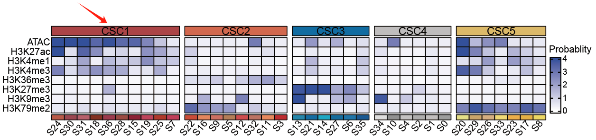
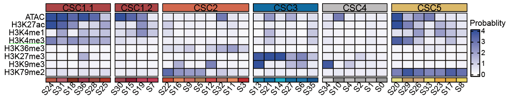
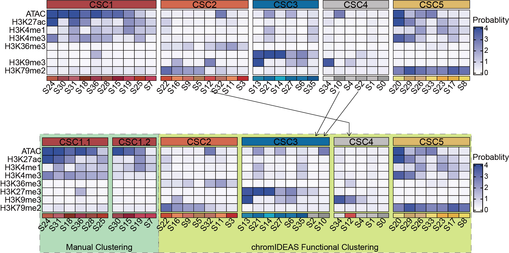
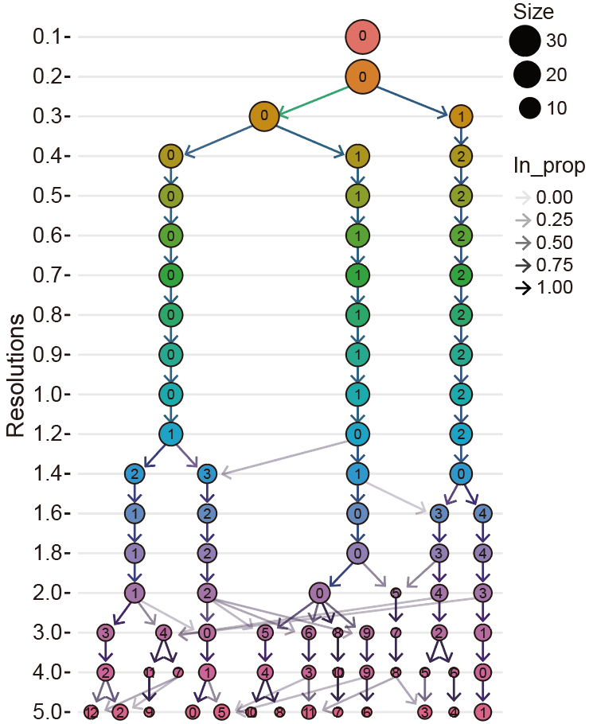

Manually Adjusting Functional Clustering of Chromatin States
============================================================

.. contents::
   :local:
   :depth: 2

Question Overview
-----------------

During functional clustering analysis, chromatin states with similar epigenetic profiles are automatically grouped into Chromatin State Clusters (CSCs). While this aggregation helps reduce noise and improve robustness for differential analysis, it may also lower the resolution of chromatin dynamics. For example, active enhancer-like states might be merged with promoter-associated states in the same CSC, potentially obscuring biologically important distinctions.

This raises the question: How can users incorporate prior biological knowledge to retain certain chromatin states as independent CSCs when justified by strong evidence?

Solution Strategies
------------------

To address this need for flexibility while maintaining methodological rigor, chromIDEAS offers two complementary strategies for manual refinement:

1. **Post-clustering refinement**: Run chromIDEAS in standard unsupervised mode to obtain primary CSCs, then subdivide specific CSCs into finer sub-clusters based on biological evidence.
2. **Pre-clustering grouping**: Define biologically distinct chromatin states as a meta-state prior to analysis, then apply chromIDEAS to cluster the remaining states.

Implementation Examples
-----------------------

Based on the following biological assumptions:

* **Promoter-like states**: S24, S31, S18, S36, S28, S25
* **Enhancer-like states**: S30, S15, S19, S7

Post-clustering Refinement
^^^^^^^^^^^^^^^^^^^^^^^^^^

After obtaining initial CSCs through standard chromIDEAS analysis, CSC1 can be manually divided into two sub-clusters:

   
   *CSC1.1 (promoter-like)*: S24, S31, S18, S36, S28, S25  
   *CSC1.2 (enhancer-like)*: S30, S15, S19, S7

Pre-clustering Grouping
^^^^^^^^^^^^^^^^^^^^^^^

**Step 1: Baseline unsupervised clustering with all states**

.. code-block:: bash

   chromIDEAS_CSC -i chromIDEAS.state -e chromIDEAS.emission.txt \
                  -r gencode.v40.annotation.gtf -o chromAllCS \
                  -f gtf -t tx -O 0.1

**Step 2: Clustering with predefined states excluded**

.. code-block:: bash

   chromIDEAS_CSC -i chromIDEAS.state -e chromIDEAS.emission.txt \
                  -r gencode.v40.annotation.gtf -o chromAllCS \
                  -f gtf -t tx -O 0.1 \
                  -E "7,15,18,19,24,25,28,30,31,36"

**Comparison of results**:

When the 10 predefined chromatin states are excluded, chromIDEAS clusters the remaining 27 states into 4 CSCs. The resulting classification shows only minor variations compared to the full analysis, demonstrating robust pattern recognition in the unsupervised framework.

Important Considerations
------------------------

While these manual adjustment strategies provide valuable flexibility, users should apply them judiciously:

* **Potential bias introduction**: Manual adjustments should be supported by substantial independent biological evidence to avoid subjective interpretations.
* **Primary strength preservation**: The core advantage of chromIDEAS remains its unbiased, data-driven functional classification. Manual adjustments should complement rather than replace this approach.
* **Alternative approach**: If users observe overly broad merging of functionally similar states without specific biological justification, consider increasing the clustering resolution (e.g., using ``res=3``) to obtain more refined CSCs while maintaining an unbiased framework.

Additional Support
------------------

For further assistance with chromIDEAS:

* Submit questions on `GitHub <https://github.com/fatyang799/chromIDEAS/issues>`_
* Contact the author via email: yangliu326459@gmail.com