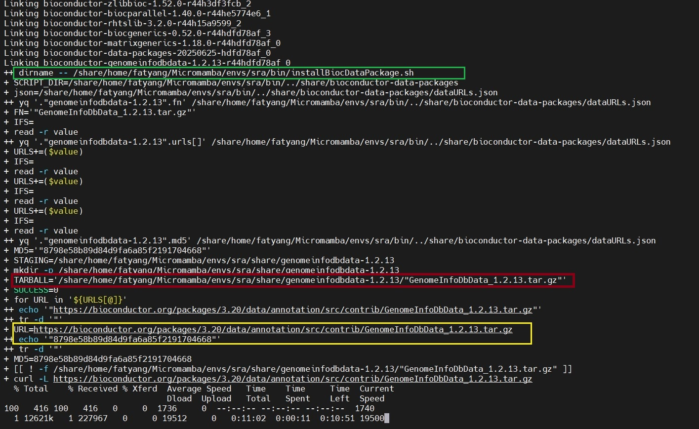

Network Issues During Installation
==================================

.. contents::
   :local:
   :depth: 2

Problem Description
-------------------

When attempting to install ``chromIDEAS`` using the command:

.. code-block:: bash

   conda install fatyang::chromideas

The process gets stuck at the following stage:

Root Cause
----------

This issue typically occurs due to poor network connectivity, which is more common in certain regions (such as China).

Solution
--------

To resolve this, manually download the ``GenomeInfoDbData_1.2.13.tar.gz`` package to bypass conda's repeated download attempts.

**Procedure:**

1. Press ``Ctrl + C`` to terminate the installation process.

2. Manually download the ``GenomeInfoDbData_1.2.13.tar.gz`` package (highlighted in yellow in the screenshot) and upload it to the server location shown in red:

   ::

      /share/home/fatyang/Micromamba/envs/sra/share/genomeinfodbdata-1.2.13/

   Ensure the filename is exactly ``"GenomeInfoDbData_1.2.13.tar.gz"``, not ``GenomeInfoDbData_1.2.13.tar.gz``.

3. Modify the installation script. Edit the ``installBiocDataPackage.sh`` script (highlighted in green) by adding the following three lines as indicated:

   .. code-block:: bash
      :emphasize-lines: 28-30

      #!/bin/bash
      set -ex
      # takes a single parameter, the package name
      
      SCRIPT_DIR="$( dirname -- "${BASH_SOURCE[0]}" )/../share/bioconductor-data-packages"
      json="${SCRIPT_DIR}/dataURLs.json"
      FN=`yq ".\"$1\".fn" "${json}"`
      ##readarray is bash4, while OSX only has bash 3
      #readarray URLS < <(yq ".\"$1\".urls[]" "${json}")
      while IFS= read -r value; do
              URLS+=($value);
      done < <(yq ".\"$1\".urls[]" "${json}")
      MD5=`yq ".\"$1\".md5" "${json}"`
      
      # Use a staging area in the conda dir rather than temp dirs, both to avoid
      # permission issues as well as to have things downloaded in a predictable
      # manner.
      STAGING=$PREFIX/share/"$1"
      mkdir -p $STAGING
      TARBALL=$STAGING/$FN
      
      SUCCESS=0
      for URL in ${URLS[@]}; do
              URL=`echo $URL | tr -d \"`  # Trim any flanking quotes
              MD5=`echo $MD5 | tr -d \"`  # Trim any flanking quotes
      
      #################################### add by fatyang ####################################
              if [[ ! -f ${TARBALL} ]]; then
                      curl -L $URL > $TARBALL
              fi
      #################################### add by fatyang ####################################
              [[ $? == 0 ]] || continue
      
              # Platform-specific md5sum checks.
              if [[ $(uname -s) == "Linux" ]]; then
                      if md5sum -c <<<"$MD5  $TARBALL"; then
                              SUCCESS=1
                              break
                      fi
              else if [[ $(uname -s) == "Darwin" ]]; then
                      if [[ $(md5 $TARBALL | cut -f4 -d " ") == "$MD5" ]]; then
                              SUCCESS=1
                              break
                      fi
              fi
      fi
      done
      
      if [[ $SUCCESS != 1 ]]; then
              echo "ERROR: post-link.sh was unable to download any of the following URLs with the md5sum $MD5:"
              printf '%s\n' "${URLS[@]}"
              exit 1
      fi
      
      # Install and clean up
      R CMD INSTALL --library=$PREFIX/lib/R/library $TARBALL
      rm $TARBALL
      rmdir $STAGING

4. Re-run the installation command:

   .. code-block:: bash

      conda install fatyang::chromideas

   The installation should now complete successfully.

Additional Support
------------------

If you encounter further issues while using ``chromIDEAS``:

* Submit questions on `GitHub <https://github.com/fatyang799/chromIDEAS/issues>`_
* Contact the author via email: yangliu326459@gmail.com