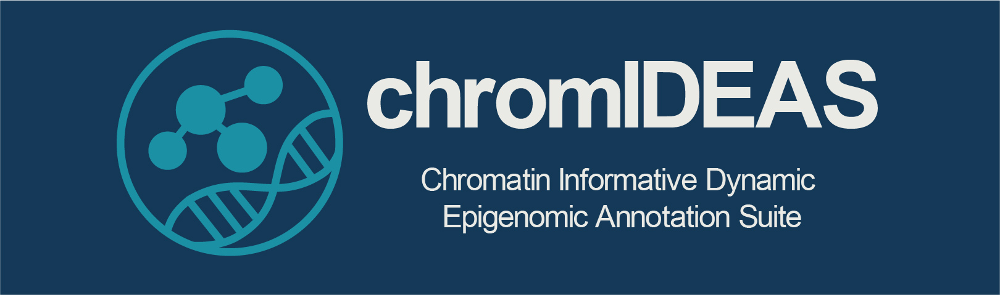
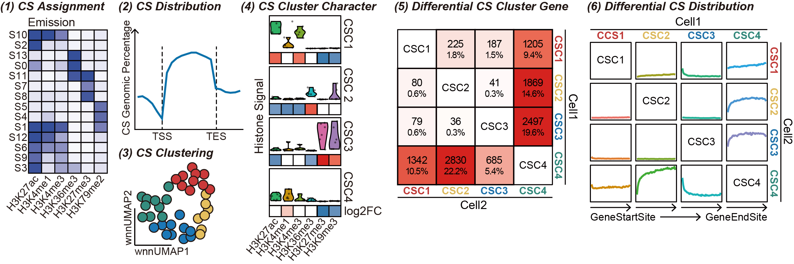

=====================================================
chromIDEAS: *Chromatin Informative Dynamic Epigenomic Annotation Suite*
=====================================================

Chromatin Informative Dynamic Epigenomic Annotation Suite (chromIDEAS) is a versatile software package for chromatin state analysis, supporting:

✅ (1) Chromatin State Segmentation: Integrates quantitative epigenetic signals across multiple cell types to define consensus chromatin states.

✅ (2) Chromatin State Distribution Visualization: Visualizes chromatin state patterns across specified genomic regions or predefined gene sets.

✅ (3) Chromatin State Functional Clustering: Applies Weighted Nearest Neighbor (WNN) algorithm to cluster chromatin states based on both genomic distribution patterns and epigenetic signal composition.

✅ (4) Chromatin State Cluster Annotation: Identifies distinctive epigenetic signatures for each chromatin state cluster.

✅ (5) Differential Chromatin State Cluster Gene Analysis: Performs differential analysis between cell types using chromatin state clusters as functional units, identifying genes associated with divergent state regions.

✅ (6) Differential Region Mapping: Maps genomic locations of differentially regulated genes and quantifies the probability distribution of differential regions.

✅ (7) Chromatin State Similarity Assessment: Evaluate the similarity of chromatin status among different cells across genome.

The flow chart below depicts the different tool modules that are
currently available.

Contents:
---------
.. toctree::
   :maxdepth: 1

   content/installation.rst
   content/list_of_tools.rst
   content/example_usage.rst
   content/about.rst

The features of chromIDEAS include:

- ✅ Multi-threading Support: Enables parallel computing to significantly accelerate chromatin state calculations. Delivers over 5x speed improvement compared to the original S3V2 software package.

- ✅ Species-Agnostic: Supports chromatin state analysis for any species without restrictions.

- ✅ Tool Compatibility: Compatible with all major chromatin state annotation tools, including but not limited to chromHMM, Segway, and Spectacle. Allows functional clustering and chromatin state distribution visualization based on existing analysis results.

- ✅ Checkpoint Restart: Features an optimized execution framework built upon S3V2 and IDEAS, supporting resumable computations from checkpoints to improve efficiency.

- ✅ One-Click Installation: Available through the conda platform for seamless deployment with a single command.

.. tip:: For bug reports and feature requests please open an issue `on github <https://github.com/fatyang799/chromIDEAS/issues>`_.

The implementation of chromIDEAS relies on the following tools:

- IDEAS (`DOI: 10.1093/nar/gkw278 <https://doi.org/10.1093/nar/gkw278>`_): Joint chromatin state segmentation across cell types using epigenetic signals instead of binary data (https://github.com/yuzhang123/IDEAS).
- S3V2 (`DOI: 10.1093/bioinformatics/btab148 <https://doi.org/10.1093/bioinformatics/btab148>`_): Normalization accounting for background and peak signal distributions (https://github.com/guanjue/S3V2_IDEAS_ESMP).
- Seurat (`DOI: 10.1016/j.cell.2021.04.048 <https://doi.org/10.1016/j.cell.2021.04.048>`_): Weighted Nearest Neighbor (WNN) algorithm to integrate multi-modal data (the genomic spatial distribution of chromatin states and their epigenetic signal compositions) (https://github.com/satijalab/seurat).

Please cite chromIDEAS2 as follows:

Liu Yang, Shan Liu, Ting Lu, Shaokang Mo, Bin Qi and Kuangyu Yen. 
**"chromIDEAS Reveals Epigenetic Dynamics via Multi-Dimensional Clustering of Chromatin States"**